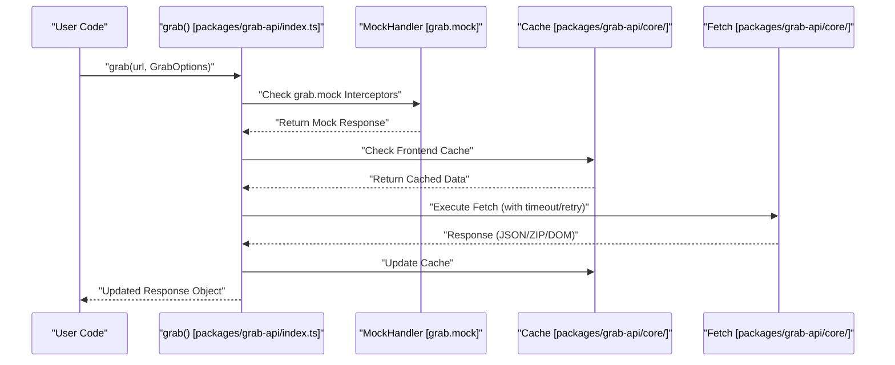

# Overview
Relevant source files
- [README.md](https://github.com/vtempest/GRAB-URL/blob/a61acaf0/README.md?plain=1)
- [docs/content/docs/grab-options.mdx](https://github.com/vtempest/GRAB-URL/blob/a61acaf0/docs/content/docs/grab-options.mdx?plain=1)
- [package-lock.json](https://github.com/vtempest/GRAB-URL/blob/a61acaf0/package-lock.json)
- [package.json](https://github.com/vtempest/GRAB-URL/blob/a61acaf0/package.json)
- [packages/archiver-web/README.md](https://github.com/vtempest/GRAB-URL/blob/a61acaf0/packages/archiver-web/README.md?plain=1)
- [packages/grab-api/README.md](https://github.com/vtempest/GRAB-URL/blob/a61acaf0/packages/grab-api/README.md?plain=1)
- [packages/grab-url-cli/README.md](https://github.com/vtempest/GRAB-URL/blob/a61acaf0/packages/grab-url-cli/README.md?plain=1)
- [packages/loading-animations/README.md](https://github.com/vtempest/GRAB-URL/blob/a61acaf0/packages/loading-animations/README.md?plain=1)
- [packages/log-json/README.md](https://github.com/vtempest/GRAB-URL/blob/a61acaf0/packages/log-json/README.md?plain=1)

`GRAB-URL` is a high-level request management monorepo designed to simplify the "fetch-to-UI" lifecycle. Its primary goal is to replace boilerplate-heavy request logic with a single, zero-dependency (at runtime) function: `grab()`.

The project provides a unified API for browser-based requests, a robust CLI for file downloads, and a suite of specialized packages for animations, logging, and ZIP processing.

## What is GRAB-URL?

At its core, `grab()` is a **Functionally Brilliant, Elegantly Simple Tool (FBEST)**[README.md29](https://github.com/vtempest/GRAB-URL/blob/a61acaf0/README.md?plain=1#L29-L29) It bridges the gap between raw `fetch` and complex state management libraries like TanStack Query by providing built-in handling for common frontend requirements:

- **State Management**: Automatically manages `.isLoading`, `.error`, and `.data` properties on response objects [README.md31](https://github.com/vtempest/GRAB-URL/blob/a61acaf0/README.md?plain=1#L31-L31)[packages/grab-api/README.md30](https://github.com/vtempest/GRAB-URL/blob/a61acaf0/packages/grab-api/README.md?plain=1#L30-L30)
- **Flow Control**: Built-in support for debouncing, rate-limiting, and automatic cancellation of duplicate requests [README.md34-46](https://github.com/vtempest/GRAB-URL/blob/a61acaf0/README.md?plain=1#L34-L46)[docs/content/docs/grab-options.mdx49-63](https://github.com/vtempest/GRAB-URL/blob/a61acaf0/docs/content/docs/grab-options.mdx?plain=1#L49-L63)
- **Smart Parsing**: Auto-detection and parsing of JSON, HTML (via `linkedom`), and ZIP archives (via `archiver-web`) [README.md49-50](https://github.com/vtempest/GRAB-URL/blob/a61acaf0/README.md?plain=1#L49-L50)[docs/content/docs/grab-options.mdx116-127](https://github.com/vtempest/GRAB-URL/blob/a61acaf0/docs/content/docs/grab-options.mdx?plain=1#L116-L127)
- **Developer Experience**: In-browser DevTools (triggered by `Ctrl+Alt+I`) and colorized JSON logging [README.md36-37](https://github.com/vtempest/GRAB-URL/blob/a61acaf0/README.md?plain=1#L36-L37)[packages/grab-api/README.md34-42](https://github.com/vtempest/GRAB-URL/blob/a61acaf0/packages/grab-api/README.md?plain=1#L34-L42)

For details on getting the library running in your project, see [Getting Started](/vtempest/GRAB-URL/1.1-getting-started).

## Monorepo Structure

The project is managed as a monorepo using **pnpm workspaces**[package.json13-16](https://github.com/vtempest/GRAB-URL/blob/a61acaf0/package.json#L13-L16) and **Turbo**[package.json87](https://github.com/vtempest/GRAB-URL/blob/a61acaf0/package.json#L87-L87) It is structured to provide a single entry point (`grab-url`) while maintaining specialized logic in isolated packages.

### Code-to-System Mapping

The following diagram illustrates how the logical systems described in documentation map to specific code entities and packages within the monorepo.

**System to Code Entity Map**

```

```

Sources: [package.json13-24](https://github.com/vtempest/GRAB-URL/blob/a61acaf0/package.json#L13-L24)[packages/grab-api/README.md18-24](https://github.com/vtempest/GRAB-URL/blob/a61acaf0/packages/grab-api/README.md?plain=1#L18-L24)[packages/grab-url-cli/README.md48-75](https://github.com/vtempest/GRAB-URL/blob/a61acaf0/packages/grab-url-cli/README.md?plain=1#L48-L75)[packages/log-json/README.md58-65](https://github.com/vtempest/GRAB-URL/blob/a61acaf0/packages/log-json/README.md?plain=1#L58-L65)

### Package Relationships

The monorepo separates concerns into several internal packages that are bundled into the final distribution [package.json25-56](https://github.com/vtempest/GRAB-URL/blob/a61acaf0/package.json#L25-L56):

| Package | Purpose |
| --- | --- |
| `packages/grab-api` | The core `grab()` request engine and lifecycle management [packages/grab-api/README.md3](https://github.com/vtempest/GRAB-URL/blob/a61acaf0/packages/grab-api/README.md?plain=1#L3-L3) |
| `packages/grab-url-cli` | Terminal interface for API requests and multi-file downloads [packages/grab-url-cli/README.md3](https://github.com/vtempest/GRAB-URL/blob/a61acaf0/packages/grab-url-cli/README.md?plain=1#L3-L3) |
| `packages/archiver-web` | Client-side ZIP extraction and compression using JSZip and fflate [packages/archiver-web/README.md3](https://github.com/vtempest/GRAB-URL/blob/a61acaf0/packages/archiver-web/README.md?plain=1#L3-L3) |
| `packages/log-json` | Colorized terminal and browser logging for JSON structures [packages/log-json/README.md3-5](https://github.com/vtempest/GRAB-URL/blob/a61acaf0/packages/log-json/README.md?plain=1#L3-L5) |
| `packages/loading-animations` | SVG and CLI spinner definitions [packages/loading-animations/README.md3-6](https://github.com/vtempest/GRAB-URL/blob/a61acaf0/packages/loading-animations/README.md?plain=1#L3-L6) |
| `packages/heyapi-client-grab` | OpenAPI SDK transport layer [README.md51](https://github.com/vtempest/GRAB-URL/blob/a61acaf0/README.md?plain=1#L51-L51) |

For a deep dive into the build pipeline and multi-format distribution, see [Monorepo Architecture & Build System](/vtempest/GRAB-URL/1.2-monorepo-architecture-and-build-system).

## Request Flow Overview

When you call `grab()`, the system follows a structured lifecycle to minimize network overhead and maximize data availability.

**Request Lifecycle Diagram**



Sources: [README.md33-41](https://github.com/vtempest/GRAB-URL/blob/a61acaf0/README.md?plain=1#L33-L41)[packages/grab-api/README.md59-78](https://github.com/vtempest/GRAB-URL/blob/a61acaf0/packages/grab-api/README.md?plain=1#L59-L78)[docs/content/docs/grab-options.mdx11-44](https://github.com/vtempest/GRAB-URL/blob/a61acaf0/docs/content/docs/grab-options.mdx?plain=1#L11-L44)

## Navigation

- **[Getting Started](/vtempest/GRAB-URL/1.1-getting-started)**: Installation via `npm i grab-url`, environment setup, and monorepo layout.
- **[Monorepo Architecture & Build System](/vtempest/GRAB-URL/1.2-monorepo-architecture-and-build-system)**: Details on `pnpm` workspaces, Turbo, and the Vite bundling strategy for ESM/CJS.
- **[Core grab() API](/vtempest/GRAB-URL/2-core-grab()-api)**: Deep dive into the request manager engine, lifecycle, and `GrabOptions`.
- **[CLI Tool (grab-url-cli)](/vtempest/GRAB-URL/3-cli-tool-(grab-url-cli))**: Documentation for the `grab-url`, `grab`, and `g` terminal commands.
- **[Supporting Packages](/vtempest/GRAB-URL/4-supporting-packages)**: Details on `archiver-web`, `log-json`, and SVG loading animations.
- **[AI Agent Integration & OpenAPI Services](/vtempest/GRAB-URL/6-ai-agent-integration-and-openapi-services)**: Using the `use-grab-request` skill for AI agents and generating MCP servers via `api2ai`.