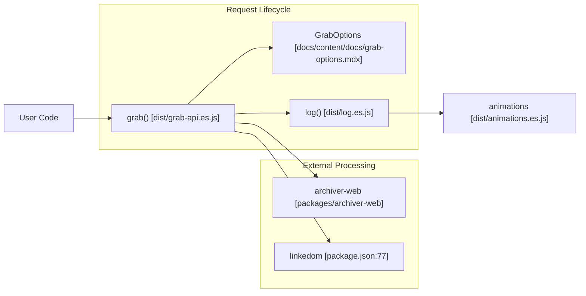
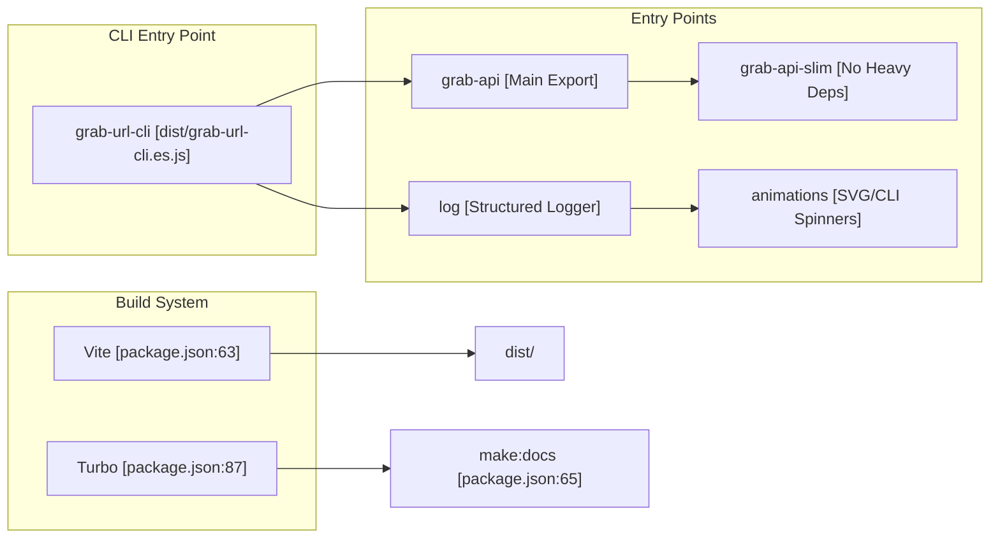

# Getting Started
Relevant source files
- [README.md](https://github.com/vtempest/GRAB-URL/blob/a61acaf0/README.md?plain=1)
- [docs/content/docs/grab-options.mdx](https://github.com/vtempest/GRAB-URL/blob/a61acaf0/docs/content/docs/grab-options.mdx?plain=1)
- [package-lock.json](https://github.com/vtempest/GRAB-URL/blob/a61acaf0/package-lock.json)
- [package.json](https://github.com/vtempest/GRAB-URL/blob/a61acaf0/package.json)
- [pnpm-workspace.yaml](https://github.com/vtempest/GRAB-URL/blob/a61acaf0/pnpm-workspace.yaml)

The **GRAB-URL** monorepo provides a functionally brilliant, elegantly simple request management ecosystem. At its core is `grab()`, a single-function alternative to `fetch` and `axios` designed to handle the complexities of modern API interaction—such as auto-JSON conversion, loading states, caching, and pagination—with zero runtime dependencies in its core execution.

## Installation

The primary way to consume the library is via the `grab-url` package, which bundles the core API and CLI tools. The package supports multiple entry points including a `slim` version that externalizes heavy dependencies like `linkedom` and `archiver-web`.

```
# Install via npm
npm i grab-url
 
# Or via bun (recommended for development)
bun add grab-url
```

Sources: [package.json1-5](https://github.com/vtempest/GRAB-URL/blob/a61acaf0/package.json#L1-L5)[package.json25-35](https://github.com/vtempest/GRAB-URL/blob/a61acaf0/package.json#L25-L35)[package.json73-78](https://github.com/vtempest/GRAB-URL/blob/a61acaf0/package.json#L73-L78)

## Quick-Start Usage

The `grab()` function is designed to be imported once and used globally. It is the primary export of the library and is available in both ESM and CJS formats.

### Basic Request

```
import grab from 'grab-url';
 
// Simple GET request
const user = await grab('user/me');
 
// POST request with parameters
const res = await grab('search', { 
  query: "search terms", 
  post: true 
});
```

Sources: [package.json17-19](https://github.com/vtempest/GRAB-URL/blob/a61acaf0/package.json#L17-L19)[package.json25-30](https://github.com/vtempest/GRAB-URL/blob/a61acaf0/package.json#L25-L30)[README.md61-75](https://github.com/vtempest/GRAB-URL/blob/a61acaf0/README.md?plain=1#L61-L75)

### Managing Loading States

Unlike standard `fetch`, `grab()` can manage an `isLoading` property on a provided response object, allowing for immediate UI reactivity in frameworks like Svelte or React.

```
let res = { results: [], isLoading: false };
 
// Pass the object to grab; it will manage the loading state
await grab('search', { response: res, query: "data" });
```

Sources: [README.md31](https://github.com/vtempest/GRAB-URL/blob/a61acaf0/README.md?plain=1#L31-L31)[README.md64-74](https://github.com/vtempest/GRAB-URL/blob/a61acaf0/README.md?plain=1#L64-L74)[README.md90-97](https://github.com/vtempest/GRAB-URL/blob/a61acaf0/README.md?plain=1#L90-L97)

## Environment Setup & Defaults

The system allows setting global defaults that apply to every `grab()` call. This is configured via the `GrabOptions` object passed with `setDefaults: true`.

```
grab("", { 
  setDefaults: true,
  baseURL: "https://api.production.com",
  timeout: 30,
  cache: true,
  debug: true
});
 
// Or modify the defaults object directly
grab.defaults.baseURL = "http://localhost:8080/api/";
```

Sources: [README.md107-118](https://github.com/vtempest/GRAB-URL/blob/a61acaf0/README.md?plain=1#L107-L118)[docs/content/docs/grab-options.mdx75-80](https://github.com/vtempest/GRAB-URL/blob/a61acaf0/docs/content/docs/grab-options.mdx?plain=1#L75-L80)

## Monorepo Workspace Layout

The project is structured as a **bun workspace** monorepo. It uses **Turbo** for task orchestration and **Vite** for bundling packages into a unified `dist/` directory at the root.

### Workspace Structure

| Path | Purpose |
| --- | --- |
| `packages/*` | Internal library packages (API, CLI, Animations, Logging). |
| `docs/` | Next.js/FumaDocs documentation portal. |
| `dist/` | Bundled output (ESM, CJS, DTS) for all exports defined in `package.json`. |

Sources: [package.json13-16](https://github.com/vtempest/GRAB-URL/blob/a61acaf0/package.json#L13-L16)[pnpm-workspace.yaml1-3](https://github.com/vtempest/GRAB-URL/blob/a61acaf0/pnpm-workspace.yaml#L1-L3)

### System Data Flow: Request Initiation

This diagram maps the natural language intent of "making a request" to the internal code entities and files that handle the lifecycle.

**Request Lifecycle & Dependency Mapping**



Sources: [package.json25-56](https://github.com/vtempest/GRAB-URL/blob/a61acaf0/package.json#L25-L56)[package.json73-78](https://github.com/vtempest/GRAB-URL/blob/a61acaf0/package.json#L73-L78)[docs/content/docs/grab-options.mdx116-127](https://github.com/vtempest/GRAB-URL/blob/a61acaf0/docs/content/docs/grab-options.mdx?plain=1#L116-L127)

## Workspace Components Interaction

The following diagram illustrates how the various packages and entry points are orchestrated by the build system and the CLI.

**Monorepo Package & Build Orchestration**



Sources: [package.json17-56](https://github.com/vtempest/GRAB-URL/blob/a61acaf0/package.json#L17-L56)[package.json62-66](https://github.com/vtempest/GRAB-URL/blob/a61acaf0/package.json#L62-L66)[package.json87-89](https://github.com/vtempest/GRAB-URL/blob/a61acaf0/package.json#L87-L89)

## Development Workflow

The project uses `vite` for unified bundling and `vitest` for testing.

1. **Install dependencies**: `bun install` (uses `package.json` and `pnpm-workspace.yaml`).
2. **Build all packages**: `npm run build` (invokes `vite build --config vite.config.ts`). This generates all formats in `dist/` including ESM, CJS, and TypeScript definitions.
3. **Generate Icons**: `npm run make:icons` (uses `export-svg-typescript` to process SVG files into TypeScript).
4. **Run Tests**: `npm test` or `npm run test:coverage` (uses `vitest` with `v8` provider).
5. **CLI Testing**: `npm run test:cli <url>` to test the downloader directly against a file URL.

Sources: [package.json62-72](https://github.com/vtempest/GRAB-URL/blob/a61acaf0/package.json#L62-L72)[package.json89-91](https://github.com/vtempest/GRAB-URL/blob/a61acaf0/package.json#L89-L91)[pnpm-workspace.yaml1-3](https://github.com/vtempest/GRAB-URL/blob/a61acaf0/pnpm-workspace.yaml#L1-L3)