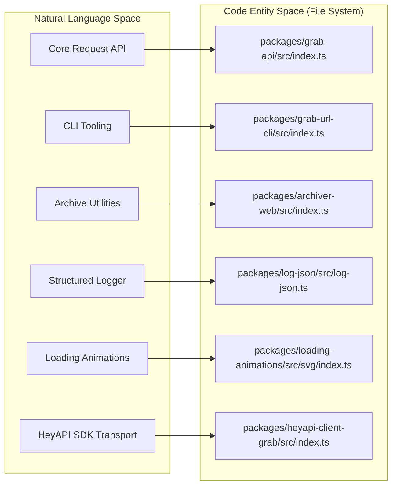
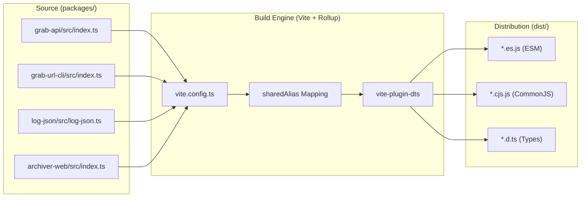
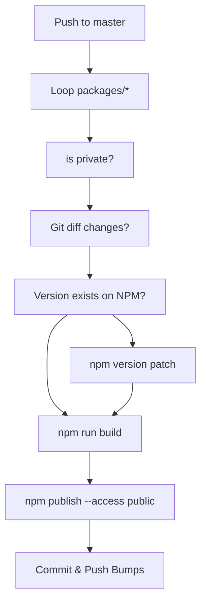

# Monorepo Architecture & Build System
Relevant source files
- [.github/workflows/npm-publish.yml](https://github.com/vtempest/GRAB-URL/blob/a61acaf0/.github/workflows/npm-publish.yml)
- [.github/workflows/tests.yml](https://github.com/vtempest/GRAB-URL/blob/a61acaf0/.github/workflows/tests.yml)
- [codecov.yml](https://github.com/vtempest/GRAB-URL/blob/a61acaf0/codecov.yml)
- [packages/archiver-web/src/index.ts](https://github.com/vtempest/GRAB-URL/blob/a61acaf0/packages/archiver-web/src/index.ts)
- [packages/grab-api/src/core/core.ts](https://github.com/vtempest/GRAB-URL/blob/a61acaf0/packages/grab-api/src/core/core.ts)
- [packages/grab-api/src/core/request-prep.ts](https://github.com/vtempest/GRAB-URL/blob/a61acaf0/packages/grab-api/src/core/request-prep.ts)
- [packages/heyapi-client-grab/src/cli.ts](https://github.com/vtempest/GRAB-URL/blob/a61acaf0/packages/heyapi-client-grab/src/cli.ts)
- [packages/loading-animations/package.json](https://github.com/vtempest/GRAB-URL/blob/a61acaf0/packages/loading-animations/package.json)
- [pnpm-workspace.yaml](https://github.com/vtempest/GRAB-URL/blob/a61acaf0/pnpm-workspace.yaml)
- [tsconfig.json](https://github.com/vtempest/GRAB-URL/blob/a61acaf0/tsconfig.json)
- [turbo.json](https://github.com/vtempest/GRAB-URL/blob/a61acaf0/turbo.json)
- [vite.config.ts](https://github.com/vtempest/GRAB-URL/blob/a61acaf0/vite.config.ts)

The GRAB-URL project is organized as a high-performance monorepo designed to deliver a unified request management ecosystem. It leverages modern tooling to manage multiple packages, ranging from the core `grab-api` to specialized CLI tools and UI components, while maintaining a single source of truth for builds and deployments.

## Workspace Structure

The repository uses **pnpm workspaces** (configured via `pnpm-workspace.yaml`[pnpm-workspace.yaml1-3](https://github.com/vtempest/GRAB-URL/blob/a61acaf0/pnpm-workspace.yaml#L1-L3)) and is managed using **Bun** as the primary package manager [.github/workflows/npm-publish.yml25-26](https://github.com/vtempest/GRAB-URL/blob/a61acaf0/.github/workflows/npm-publish.yml#L25-L26) The workspace boundaries include all utility packages and the documentation site [pnpm-workspace.yaml1-3](https://github.com/vtempest/GRAB-URL/blob/a61acaf0/pnpm-workspace.yaml#L1-L3)

| Path | Package Name | Purpose |
| --- | --- | --- |
| `packages/grab-api` | `grab-url` | The core request engine and primary entry point. [vite.config.ts40](https://github.com/vtempest/GRAB-URL/blob/a61acaf0/vite.config.ts#L40-L40) |
| `packages/grab-url-cli` | `@grab-url/cli` | Command-line interface for file downloads and API testing. [vite.config.ts73](https://github.com/vtempest/GRAB-URL/blob/a61acaf0/vite.config.ts#L73-L73) |
| `packages/archiver-web` | `archiver-web` | Browser-compatible ZIP extraction and compression. [packages/archiver-web/src/index.ts1-8](https://github.com/vtempest/GRAB-URL/blob/a61acaf0/packages/archiver-web/src/index.ts#L1-L8) |
| `packages/log-json` | `@grab-url/log` | Colorized structured logging for Node and Browser. [vite.config.ts72](https://github.com/vtempest/GRAB-URL/blob/a61acaf0/vite.config.ts#L72-L72) |
| `packages/loading-animations` | `loading-animations` | Tree-shakable SVG and CLI terminal spinner data. [packages/loading-animations/package.json2-4](https://github.com/vtempest/GRAB-URL/blob/a61acaf0/packages/loading-animations/package.json#L2-L4) |
| `packages/quantum-sphere...` | `quantum-sphere` | Specialized animated loader component for React/Svelte. [vite.config.ts71](https://github.com/vtempest/GRAB-URL/blob/a61acaf0/vite.config.ts#L71-L71) |
| `packages/heyapi-client-grab` | `heyapi-client-grab` | OpenAPI SDK transport for Hey API. [packages/heyapi-client-grab/src/cli.ts14-15](https://github.com/vtempest/GRAB-URL/blob/a61acaf0/packages/heyapi-client-grab/src/cli.ts#L14-L15) |
| `docs` | `grab-url-docs` | Next.js/FumaDocs documentation portal. [pnpm-workspace.yaml3](https://github.com/vtempest/GRAB-URL/blob/a61acaf0/pnpm-workspace.yaml#L3-L3) |

**Sources:**[pnpm-workspace.yaml1-3](https://github.com/vtempest/GRAB-URL/blob/a61acaf0/pnpm-workspace.yaml#L1-L3)[.github/workflows/npm-publish.yml25-26](https://github.com/vtempest/GRAB-URL/blob/a61acaf0/.github/workflows/npm-publish.yml#L25-L26)[vite.config.ts60-86](https://github.com/vtempest/GRAB-URL/blob/a61acaf0/vite.config.ts#L60-L86)[packages/heyapi-client-grab/src/cli.ts7-11](https://github.com/vtempest/GRAB-URL/blob/a61acaf0/packages/heyapi-client-grab/src/cli.ts#L7-L11)[packages/loading-animations/package.json2-4](https://github.com/vtempest/GRAB-URL/blob/a61acaf0/packages/loading-animations/package.json#L2-L4)

### Dependency Graph & Entity Mapping

The following diagram maps the logical build entities to their physical locations in the codebase, illustrating how the build system resolves internal references through Vite aliases.

**Code Entity to Workspace Mapping**

**Sources:**[vite.config.ts35-41](https://github.com/vtempest/GRAB-URL/blob/a61acaf0/vite.config.ts#L35-L41)[vite.config.ts60-86](https://github.com/vtempest/GRAB-URL/blob/a61acaf0/vite.config.ts#L60-L86)[tsconfig.json21-29](https://github.com/vtempest/GRAB-URL/blob/a61acaf0/tsconfig.json#L21-L29)

---

## Build System: Vite & Turbo

The monorepo employs **Turbo** for task orchestration [turbo.json1-8](https://github.com/vtempest/GRAB-URL/blob/a61acaf0/turbo.json#L1-L8) and **Vite** as the primary bundler [vite.config.ts2](https://github.com/vtempest/GRAB-URL/blob/a61acaf0/vite.config.ts#L2-L2) Unlike traditional monorepos that build each package into its own local directory, GRAB-URL uses a centralized build strategy where Vite bundles all package entry points into a root-level `dist/` directory [vite.config.ts54](https://github.com/vtempest/GRAB-URL/blob/a61acaf0/vite.config.ts#L54-L54)[tsconfig.json13-14](https://github.com/vtempest/GRAB-URL/blob/a61acaf0/tsconfig.json#L13-L14)

### Multi-Format Output Strategy

Vite is configured to produce multiple formats to ensure compatibility across environments (Node.js, Browsers, and ESM-only runtimes) [vite.config.ts87](https://github.com/vtempest/GRAB-URL/blob/a61acaf0/vite.config.ts#L87-L87)

- **ESM (.es.js):** Target for modern bundlers and browsers. [vite.config.ts88](https://github.com/vtempest/GRAB-URL/blob/a61acaf0/vite.config.ts#L88-L88)
- **CJS (.cjs.js):** Compatibility for legacy Node.js environments. [vite.config.ts88](https://github.com/vtempest/GRAB-URL/blob/a61acaf0/vite.config.ts#L88-L88)
- **DTS (.d.ts):** Generated via `vite-plugin-dts` for full TypeScript support. [vite.config.ts44-57](https://github.com/vtempest/GRAB-URL/blob/a61acaf0/vite.config.ts#L44-L57)

### Entry Point Configuration

The `vite.config.ts` defines several specialized entry points in the `build.lib.entry` object [vite.config.ts67-86](https://github.com/vtempest/GRAB-URL/blob/a61acaf0/vite.config.ts#L67-L86):

1. `grab-api`: Full bundle including all features. [vite.config.ts68](https://github.com/vtempest/GRAB-URL/blob/a61acaf0/vite.config.ts#L68-L68)
2. `grab-api-slim`: Excludes heavy dependencies like `linkedom` and `archiver-web` for minimal bundle size. [vite.config.ts69](https://github.com/vtempest/GRAB-URL/blob/a61acaf0/vite.config.ts#L69-L69)
3. `grab-url-cli`: Includes a Node.js shebang via `rollupOptions.output.banner`. [vite.config.ts73](https://github.com/vtempest/GRAB-URL/blob/a61acaf0/vite.config.ts#L73-L73)[vite.config.ts93-96](https://github.com/vtempest/GRAB-URL/blob/a61acaf0/vite.config.ts#L93-L96)
4. `animations`: SVG-based loading icons. [vite.config.ts70](https://github.com/vtempest/GRAB-URL/blob/a61acaf0/vite.config.ts#L70-L70)
5. `archiver-web`: Standalone archive utilities. [vite.config.ts74-77](https://github.com/vtempest/GRAB-URL/blob/a61acaf0/vite.config.ts#L74-L77)
6. `bin-extract` / `bin-compress`: CLI entry points for archiver utilities. [vite.config.ts78-85](https://github.com/vtempest/GRAB-URL/blob/a61acaf0/vite.config.ts#L78-L85)

**Build Process Flow**

**Sources:**[vite.config.ts35-41](https://github.com/vtempest/GRAB-URL/blob/a61acaf0/vite.config.ts#L35-L41)[vite.config.ts44-112](https://github.com/vtempest/GRAB-URL/blob/a61acaf0/vite.config.ts#L44-L112)[tsconfig.json13-14](https://github.com/vtempest/GRAB-URL/blob/a61acaf0/tsconfig.json#L13-L14)[turbo.json1-8](https://github.com/vtempest/GRAB-URL/blob/a61acaf0/turbo.json#L1-L8)

---

## Externalization & Slim Builds

To maintain a small footprint, the build system selectively externalizes dependencies. Node.js built-ins (e.g., `fs`, `path`, `stream`, `crypto`) are always marked as external [vite.config.ts6-30](https://github.com/vtempest/GRAB-URL/blob/a61acaf0/vite.config.ts#L6-L30)[vite.config.ts101](https://github.com/vtempest/GRAB-URL/blob/a61acaf0/vite.config.ts#L101-L101)

### The Slim Strategy

The `grab-api-slim` entry point specifically externalizes `archiver-web` and `linkedom`[vite.config.ts33](https://github.com/vtempest/GRAB-URL/blob/a61acaf0/vite.config.ts#L33-L33)[vite.config.ts105](https://github.com/vtempest/GRAB-URL/blob/a61acaf0/vite.config.ts#L105-L105) This allows users to import a lightweight version of the library. When using the full build, these dependencies are resolved, but `archiver-web` itself uses a dynamic import strategy to load `jszip` or `fflate` from a CDN if not present locally [packages/archiver-web/src/index.ts28-55](https://github.com/vtempest/GRAB-URL/blob/a61acaf0/packages/archiver-web/src/index.ts#L28-L55)[packages/archiver-web/src/index.ts66-87](https://github.com/vtempest/GRAB-URL/blob/a61acaf0/packages/archiver-web/src/index.ts#L66-L87)

**Sources:**[vite.config.ts100-107](https://github.com/vtempest/GRAB-URL/blob/a61acaf0/vite.config.ts#L100-L107)[packages/archiver-web/src/index.ts28-87](https://github.com/vtempest/GRAB-URL/blob/a61acaf0/packages/archiver-web/src/index.ts#L28-L87)[packages/grab-api/src/core/core.ts27-30](https://github.com/vtempest/GRAB-URL/blob/a61acaf0/packages/grab-api/src/core/core.ts#L27-L30)

---

## CI/CD & Publishing Workflow

The project uses a custom GitHub Action for publishing to NPM [.github/workflows/npm-publish.yml1-5](https://github.com/vtempest/GRAB-URL/blob/a61acaf0/.github/workflows/npm-publish.yml#L1-L5) The workflow is designed to detect changes within the `packages/` directory and automatically handle versioning.

### Automated Release Steps

1. **Change Detection:** The workflow compares `HEAD^` to `HEAD` for each directory in `packages/` to avoid unnecessary releases [.github/workflows/npm-publish.yml57-60](https://github.com/vtempest/GRAB-URL/blob/a61acaf0/.github/workflows/npm-publish.yml#L57-L60)
2. **Auto-Patching:** If a package version already exists on the NPM registry, the script runs `npm version patch` automatically [.github/workflows/npm-publish.yml67-73](https://github.com/vtempest/GRAB-URL/blob/a61acaf0/.github/workflows/npm-publish.yml#L67-L73)
3. **Build Execution:** If a `package.json` contains a `build` script, it is executed before publishing [.github/workflows/npm-publish.yml77-80](https://github.com/vtempest/GRAB-URL/blob/a61acaf0/.github/workflows/npm-publish.yml#L77-L80)
4. **Provenance:** Packages are published with `--provenance` for enhanced security [.github/workflows/npm-publish.yml83](https://github.com/vtempest/GRAB-URL/blob/a61acaf0/.github/workflows/npm-publish.yml#L83-L83)
5. **Sync:** Version bumps are committed back to the `master` branch with a `[skip ci]` flag to prevent infinite loops [.github/workflows/npm-publish.yml95-101](https://github.com/vtempest/GRAB-URL/blob/a61acaf0/.github/workflows/npm-publish.yml#L95-L101)

**Publishing Logic**

**Sources:**[.github/workflows/npm-publish.yml32-93](https://github.com/vtempest/GRAB-URL/blob/a61acaf0/.github/workflows/npm-publish.yml#L32-L93)[.github/workflows/npm-publish.yml95-101](https://github.com/vtempest/GRAB-URL/blob/a61acaf0/.github/workflows/npm-publish.yml#L95-L101)[.github/workflows/tests.yml1-34](https://github.com/vtempest/GRAB-URL/blob/a61acaf0/.github/workflows/tests.yml#L1-L34)

### Testing Infrastructure

Testing is handled via Vitest with coverage reporting provided by the `v8` provider [vite.config.ts114-115](https://github.com/vtempest/GRAB-URL/blob/a61acaf0/vite.config.ts#L114-L115) Reports are generated in `text`, `json`, and `lcov` formats [vite.config.ts116](https://github.com/vtempest/GRAB-URL/blob/a61acaf0/vite.config.ts#L116-L116) and uploaded to Codecov via GitHub Actions [.github/workflows/tests.yml27-34](https://github.com/vtempest/GRAB-URL/blob/a61acaf0/.github/workflows/tests.yml#L27-L34)

**Sources:**[vite.config.ts113-132](https://github.com/vtempest/GRAB-URL/blob/a61acaf0/vite.config.ts#L113-L132)[.github/workflows/tests.yml24-34](https://github.com/vtempest/GRAB-URL/blob/a61acaf0/.github/workflows/tests.yml#L24-L34)[codecov.yml1-22](https://github.com/vtempest/GRAB-URL/blob/a61acaf0/codecov.yml#L1-L22)