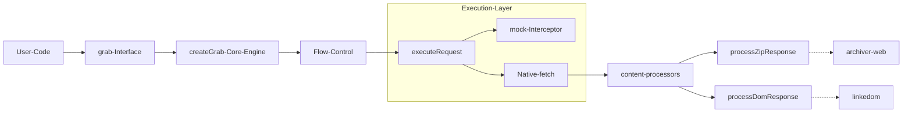

# Core grab() API
Relevant source files
- [dist/grab-api.cjs.js](https://github.com/vtempest/GRAB-URL/blob/a61acaf0/dist/grab-api.cjs.js)
- [dist/grab-api.cjs.js.map](https://github.com/vtempest/GRAB-URL/blob/a61acaf0/dist/grab-api.cjs.js.map)
- [dist/grab-api.es.js](https://github.com/vtempest/GRAB-URL/blob/a61acaf0/dist/grab-api.es.js)
- [dist/grab-api.es.js.map](https://github.com/vtempest/GRAB-URL/blob/a61acaf0/dist/grab-api.es.js.map)
- [dist/grab-api/common/types.d.ts](https://github.com/vtempest/GRAB-URL/blob/a61acaf0/dist/grab-api/common/types.d.ts)
- [packages/archiver-web/README.md](https://github.com/vtempest/GRAB-URL/blob/a61acaf0/packages/archiver-web/README.md?plain=1)
- [packages/archiver-web/tsconfig.json](https://github.com/vtempest/GRAB-URL/blob/a61acaf0/packages/archiver-web/tsconfig.json)
- [packages/grab-api/README.md](https://github.com/vtempest/GRAB-URL/blob/a61acaf0/packages/grab-api/README.md?plain=1)
- [packages/grab-api/src/common/types.ts](https://github.com/vtempest/GRAB-URL/blob/a61acaf0/packages/grab-api/src/common/types.ts)
- [packages/grab-api/src/index.ts](https://github.com/vtempest/GRAB-URL/blob/a61acaf0/packages/grab-api/src/index.ts)
- [packages/grab-url-cli/README.md](https://github.com/vtempest/GRAB-URL/blob/a61acaf0/packages/grab-url-cli/README.md?plain=1)
- [packages/grab-url-cli/package.json](https://github.com/vtempest/GRAB-URL/blob/a61acaf0/packages/grab-url-cli/package.json)
- [packages/loading-animations/README.md](https://github.com/vtempest/GRAB-URL/blob/a61acaf0/packages/loading-animations/README.md?plain=1)
- [packages/log-json/README.md](https://github.com/vtempest/GRAB-URL/blob/a61acaf0/packages/log-json/README.md?plain=1)

The `grab()` API is the primary entry point for the **GRAB-URL** ecosystem. It is a high-level request manager designed to replace standard `fetch` or `axios` with a more declarative, feature-rich interface that handles common frontend concerns—such as loading states, caching, and content processing—automatically.

### API Philosophy & Key Features

The `grab()` function [packages/grab-api/index.ts9-20](https://github.com/vtempest/GRAB-URL/blob/a61acaf0/packages/grab-api/index.ts#L9-L20) is built on the principle of "smart defaults." While it exposes a simple `path` and `options` signature, it internally orchestrates complex behaviors:

- **Reactive State Integration**: By passing a `response` object in the options, `grab` automatically manages `isLoading`, `error`, and data population [packages/grab-api/src/common/types.ts29-33](https://github.com/vtempest/GRAB-URL/blob/a61acaf0/packages/grab-api/src/common/types.ts#L29-L33)
- **Auto-Detection**: It inspects `Content-Type` headers to automatically unzip files or parse HTML into a DOM-like structure via `linkedom`[dist/grab-api.es.js.map1](https://github.com/vtempest/GRAB-URL/blob/a61acaf0/dist/grab-api.es.js.map#L1-L1)
- **Flow Control**: Built-in support for debouncing, rate limiting, and automatic request cancellation to prevent race conditions [packages/grab-api/src/common/types.ts44-49](https://github.com/vtempest/GRAB-URL/blob/a61acaf0/packages/grab-api/src/common/types.ts#L44-L49)
- **Environment Agnostic**: Works in both Browser and Node.js environments, attaching itself to `window.grab` or `globalThis.grab` for global accessibility [packages/grab-api/index.ts33-62](https://github.com/vtempest/GRAB-URL/blob/a61acaf0/packages/grab-api/index.ts#L33-L62)
- **Instance Creation**: Users can create isolated instances with pre-configured defaults using `grab.instance()`[packages/grab-api/index.ts19-21](https://github.com/vtempest/GRAB-URL/blob/a61acaf0/packages/grab-api/index.ts#L19-L21)
- **AI Agent Friendly**: Includes a specialized `supports` flag [packages/grab-api/index.ts30](https://github.com/vtempest/GRAB-URL/blob/a61acaf0/packages/grab-api/index.ts#L30-L30) to ensure compatibility with AI coding agents.

### Code Entity Mapping

The following diagram illustrates how the natural language concepts of the API map to specific code entities within the `grab-api` package.

**Conceptual to Code Mapping**

```

```

Sources: [packages/grab-api/src/index.ts1-26](https://github.com/vtempest/GRAB-URL/blob/a61acaf0/packages/grab-api/src/index.ts#L1-L26)[packages/grab-api/src/common/types.ts13-141](https://github.com/vtempest/GRAB-URL/blob/a61acaf0/packages/grab-api/src/common/types.ts#L13-L141)

---

### Internal Module Architecture

The `grab()` API is not a single monolithic function but a composition of several specialized modules.

| Module | Responsibility | Key File |
| --- | --- | --- |
| **Core Engine** | Orchestrates the lifecycle (merging defaults, flow control). | `packages/grab-api/core/core.ts` |
| **Request Executor** | Handles the actual `fetch` call and mock interception. | [dist/grab-api.es.js.map1](https://github.com/vtempest/GRAB-URL/blob/a61acaf0/dist/grab-api.es.js.map#L1-L1) |
| **Content Processors** | Logic for unzipping and DOM parsing. | [dist/grab-api.es.js.map1](https://github.com/vtempest/GRAB-URL/blob/a61acaf0/dist/grab-api.es.js.map#L1-L1) |
| **Utilities** | URL normalization, debouncing, and environment detection. | [packages/grab-api/index.ts69-71](https://github.com/vtempest/GRAB-URL/blob/a61acaf0/packages/grab-api/index.ts#L69-L71) |
| **DevTools** | Visual overlay for debugging requests (Localhost only). | [packages/grab-api/index.ts39](https://github.com/vtempest/GRAB-URL/blob/a61acaf0/packages/grab-api/index.ts#L39-L39) |

**Internal Component Interaction**



Sources: [packages/grab-api/index.ts1-3](https://github.com/vtempest/GRAB-URL/blob/a61acaf0/packages/grab-api/index.ts#L1-L3)[dist/grab-api.es.js.map1](https://github.com/vtempest/GRAB-URL/blob/a61acaf0/dist/grab-api.es.js.map#L1-L1)[dist/grab-api.es.js.map1](https://github.com/vtempest/GRAB-URL/blob/a61acaf0/dist/grab-api.es.js.map#L1-L1)

---

### Deep Dives

For detailed technical information on specific subsystems of the `grab()` API, refer to the following child pages:

- **[GrabOptions & TypeScript Types](/vtempest/GRAB-URL/2.1-graboptions-and-typescript-types)**: Complete reference for the `GrabOptions` configuration object and all exported TypeScript interfaces like `GrabResponse`, `GrabMockHandler`, and `GrabLogEntry`[packages/grab-api/src/common/types.ts1-160](https://github.com/vtempest/GRAB-URL/blob/a61acaf0/packages/grab-api/src/common/types.ts#L1-L160)
- **[Request Lifecycle & Core Engine](/vtempest/GRAB-URL/2.2-request-lifecycle-and-core-engine)**: A step-by-step walkthrough of how a request is prepared, executed, and cleaned up via `executeRequest`[dist/grab-api.es.js.map1](https://github.com/vtempest/GRAB-URL/blob/a61acaf0/dist/grab-api.es.js.map#L1-L1)
- **[Content Processors: ZIP, DOM & HTML](/vtempest/GRAB-URL/2.3-content-processors:-zip-dom-and-html)**: Details on the `archiver-web` and `linkedom` integrations used in `processZipResponse` and `processDomResponse`[dist/grab-api.es.js.map1](https://github.com/vtempest/GRAB-URL/blob/a61acaf0/dist/grab-api.es.js.map#L1-L1)
- **[Caching, Regrab Events & Infinite Scroll](/vtempest/GRAB-URL/2.4-caching-regrab-events-and-infinite-scroll)**: How the memory cache works and how to implement infinite scroll with automatic scroll position recovery via `localStorage`[packages/grab-api/index.ts42-58](https://github.com/vtempest/GRAB-URL/blob/a61acaf0/packages/grab-api/index.ts#L42-L58)
- **[DevTools, Mocking & Testing](/vtempest/GRAB-URL/2.5-devtools-mocking-and-testing)**: Guide to using the built-in `setupDevTools` overlay and the `grab.mock` system for unit testing [packages/grab-api/index.ts24-26](https://github.com/vtempest/GRAB-URL/blob/a61acaf0/packages/grab-api/index.ts#L24-L26)