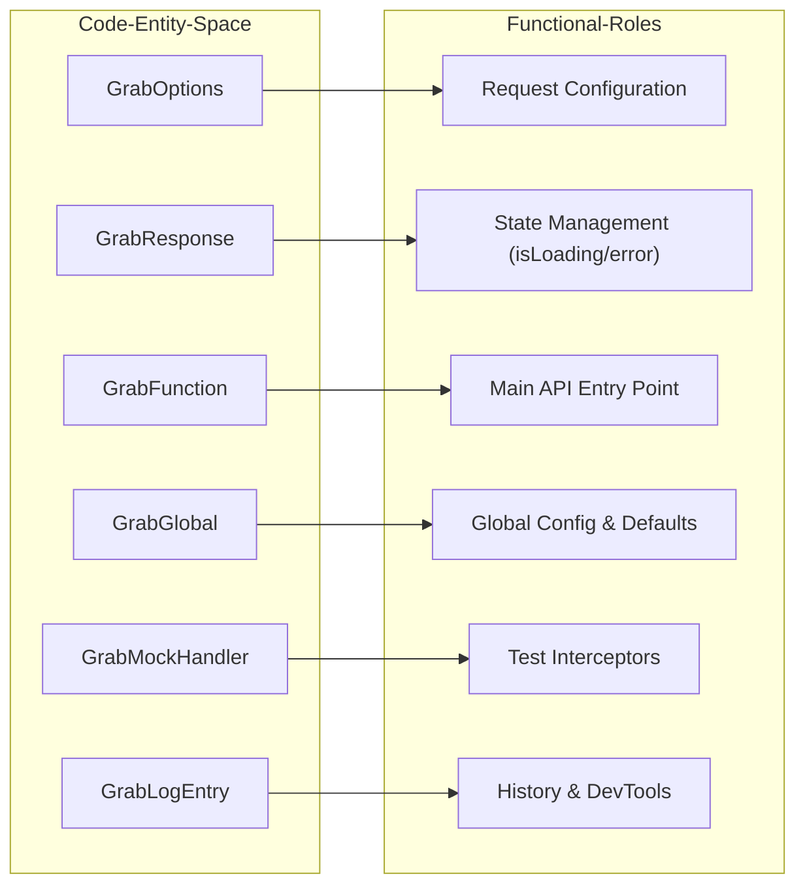
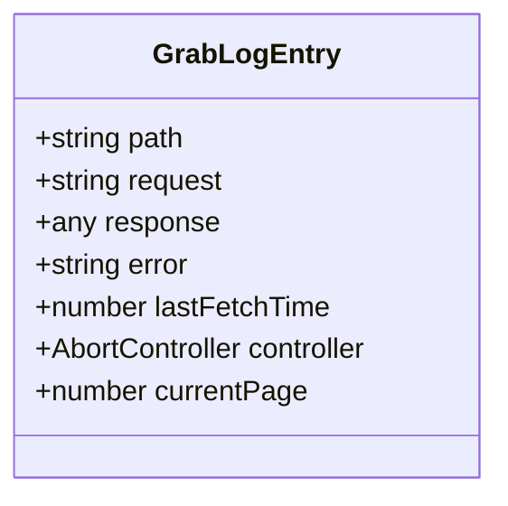
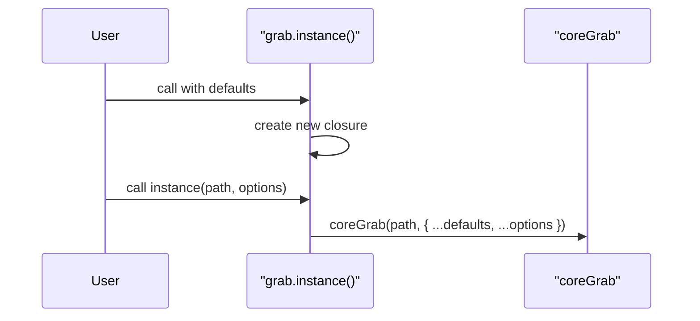

# GrabOptions & TypeScript Types
Relevant source files
- [README.md](https://github.com/vtempest/GRAB-URL/blob/a61acaf0/README.md?plain=1)
- [dist/grab-api.d.ts](https://github.com/vtempest/GRAB-URL/blob/a61acaf0/dist/grab-api.d.ts)
- [docs/content/docs/claude-skill.mdx](https://github.com/vtempest/GRAB-URL/blob/a61acaf0/docs/content/docs/claude-skill.mdx?plain=1)
- [docs/content/docs/cli.mdx](https://github.com/vtempest/GRAB-URL/blob/a61acaf0/docs/content/docs/cli.mdx?plain=1)
- [docs/content/docs/configuration.mdx](https://github.com/vtempest/GRAB-URL/blob/a61acaf0/docs/content/docs/configuration.mdx?plain=1)
- [docs/content/docs/examples.mdx](https://github.com/vtempest/GRAB-URL/blob/a61acaf0/docs/content/docs/examples.mdx?plain=1)
- [docs/content/docs/grab-options.mdx](https://github.com/vtempest/GRAB-URL/blob/a61acaf0/docs/content/docs/grab-options.mdx?plain=1)
- [docs/content/docs/options.mdx](https://github.com/vtempest/GRAB-URL/blob/a61acaf0/docs/content/docs/options.mdx?plain=1)
- [packages/grab-api/src/common/types.ts](https://github.com/vtempest/GRAB-URL/blob/a61acaf0/packages/grab-api/src/common/types.ts)
- [packages/grab-api/src/index.ts](https://github.com/vtempest/GRAB-URL/blob/a61acaf0/packages/grab-api/src/index.ts)
- [packages/grab-url-cli/package.json](https://github.com/vtempest/GRAB-URL/blob/a61acaf0/packages/grab-url-cli/package.json)

This page provides a comprehensive reference for the TypeScript interfaces and configuration objects used in the `grab-url` core API. These types define the contract for request configuration, response handling, and the internal state of the request manager.

## Core Type Hierarchy

The `grab()` API is built around a flexible options object that supports generics for both request parameters and response shapes.

### Data Flow & Type Association

The following diagram illustrates how TypeScript interfaces map to the functional entities within the `grab-api` package.

**Diagram: Code Entity Association**



Sources: [packages/grab-api/src/common/types.ts1-166](https://github.com/vtempest/GRAB-URL/blob/a61acaf0/packages/grab-api/src/common/types.ts#L1-L166)

---

## GrabOptions Interface

`GrabOptions` is the primary configuration object passed to `grab(path, options)`. It controls everything from HTTP methods to advanced features like automatic ZIP extraction and infinite scroll.

### Definition

[packages/grab-api/src/common/types.ts29-103](https://github.com/vtempest/GRAB-URL/blob/a61acaf0/packages/grab-api/src/common/types.ts#L29-L103)

### Configuration Fields

| Field | Type | Default | Description |
| --- | --- | --- | --- |
| `method` | `string` | `"GET"` | HTTP method. Shortcuts `post`, `put`, `patch` are also available [packages/grab-api/src/common/types.ts35](https://github.com/vtempest/GRAB-URL/blob/a61acaf0/packages/grab-api/src/common/types.ts#L35-L35) |
| `response` | `TResponse \| object` | `undefined` | A pre-initialized object or function. `grab` will populate this object's fields directly, enabling reactive UI updates [packages/grab-api/src/common/types.ts33](https://github.com/vtempest/GRAB-URL/blob/a61acaf0/packages/grab-api/src/common/types.ts#L33-L33) |
| `baseURL` | `string` | `auto` | Prepended to relative paths. Auto-detects from `SERVER_API_URL` env [packages/grab-api/src/common/types.ts43](https://github.com/vtempest/GRAB-URL/blob/a61acaf0/packages/grab-api/src/common/types.ts#L43-L43) |
| `headers` | `Record<string, string>` | `{}` | Custom HTTP headers for the request [packages/grab-api/src/common/types.ts31](https://github.com/vtempest/GRAB-URL/blob/a61acaf0/packages/grab-api/src/common/types.ts#L31-L31) |
| `body` | `any` | `null` | The request body for POST/PUT/PATCH [packages/grab-api/src/common/types.ts100](https://github.com/vtempest/GRAB-URL/blob/a61acaf0/packages/grab-api/src/common/types.ts#L100-L100) |
| `timeout` | `number` | `30` | Request timeout in seconds [packages/grab-api/src/common/types.ts41](https://github.com/vtempest/GRAB-URL/blob/a61acaf0/packages/grab-api/src/common/types.ts#L41-L41) |
| `cache` | `boolean` | `false` | Enables frontend memory caching [packages/grab-api/src/common/types.ts37](https://github.com/vtempest/GRAB-URL/blob/a61acaf0/packages/grab-api/src/common/types.ts#L37-L37) |
| `cacheForTime` | `number` | `60` | Seconds until a cached response is considered stale [packages/grab-api/src/common/types.ts39](https://github.com/vtempest/GRAB-URL/blob/a61acaf0/packages/grab-api/src/common/types.ts#L39-L39) |
| `debounce` | `number` | `0` | Seconds to debounce the request [packages/grab-api/src/common/types.ts86](https://github.com/vtempest/GRAB-URL/blob/a61acaf0/packages/grab-api/src/common/types.ts#L86-L86) |
| `rateLimit` | `number` | `0` | Minimum seconds to wait between subsequent requests to the same path [packages/grab-api/src/common/types.ts49](https://github.com/vtempest/GRAB-URL/blob/a61acaf0/packages/grab-api/src/common/types.ts#L49-L49) |
| `cancelOngoingIfNew` | `boolean` | `true` | Aborts previous unfinished requests to the same path when a new one starts [packages/grab-api/src/common/types.ts45](https://github.com/vtempest/GRAB-URL/blob/a61acaf0/packages/grab-api/src/common/types.ts#L45-L45) |
| `retryAttempts` | `number` | `0` | Number of times to retry on failure [packages/grab-api/src/common/types.ts57](https://github.com/vtempest/GRAB-URL/blob/a61acaf0/packages/grab-api/src/common/types.ts#L57-L57) |
| `debug` | `boolean` | `localhost` | Enables colorized console logging of request/response [packages/grab-api/src/common/types.ts51](https://github.com/vtempest/GRAB-URL/blob/a61acaf0/packages/grab-api/src/common/types.ts#L51-L51) |
| `setDefaults` | `boolean` | `false` | If true, applies these options to all future `grab` calls [packages/grab-api/src/common/types.ts55](https://github.com/vtempest/GRAB-URL/blob/a61acaf0/packages/grab-api/src/common/types.ts#L55-L55) |

### Lifecycle & Hook Options

| Field | Type | Description |
| --- | --- | --- |
| `onRequest` | `(...args: any[]) => any` | Intercept and modify request data (path, response, params, fetchParams) [packages/grab-api/src/common/types.ts61](https://github.com/vtempest/GRAB-URL/blob/a61acaf0/packages/grab-api/src/common/types.ts#L61-L61) |
| `onResponse` | `(...args: any[]) => any` | Intercept and modify response data [packages/grab-api/src/common/types.ts63](https://github.com/vtempest/GRAB-URL/blob/a61acaf0/packages/grab-api/src/common/types.ts#L63-L63) |
| `onError` | `(...args: any[]) => any` | Custom error handler [packages/grab-api/src/common/types.ts65](https://github.com/vtempest/GRAB-URL/blob/a61acaf0/packages/grab-api/src/common/types.ts#L65-L65) |
| `onRawResponse` | `(response: Response) => void` | Called with the raw fetch Response before status checks and body parsing [packages/grab-api/src/common/types.ts70](https://github.com/vtempest/GRAB-URL/blob/a61acaf0/packages/grab-api/src/common/types.ts#L70-L70) |
| `onStream` | `(...args: any[]) => any` | Process the response as a stream. Yields ZIP entries as they arrive [packages/grab-api/src/common/types.ts74](https://github.com/vtempest/GRAB-URL/blob/a61acaf0/packages/grab-api/src/common/types.ts#L74-L74) |

### Advanced Processor Options

| Field | Type | Default | Description |
| --- | --- | --- | --- |
| `unzip` | `boolean` | `auto` | Auto-extract ZIP files into a filename-to-content map [packages/grab-api/src/common/types.ts76](https://github.com/vtempest/GRAB-URL/blob/a61acaf0/packages/grab-api/src/common/types.ts#L76-L76) |
| `parseDOM` | `string \| boolean` | `auto` | CSS selector to extract from HTML; uses `linkedom` for parsing [packages/grab-api/src/common/types.ts78](https://github.com/vtempest/GRAB-URL/blob/a61acaf0/packages/grab-api/src/common/types.ts#L78-L78) |
| `unescapeHTML` | `boolean` | `auto` | Converts URL-safe entities back to standard characters [packages/grab-api/src/common/types.ts80](https://github.com/vtempest/GRAB-URL/blob/a61acaf0/packages/grab-api/src/common/types.ts#L80-L80) |
| `infiniteScroll` | `[string, string, string \| HTMLElement]` | `null` | `[pageKey, responseListField, containerSelector]` for auto-pagination [packages/grab-api/src/common/types.ts53](https://github.com/vtempest/GRAB-URL/blob/a61acaf0/packages/grab-api/src/common/types.ts#L53-L53) |

Sources: [packages/grab-api/src/common/types.ts29-103](https://github.com/vtempest/GRAB-URL/blob/a61acaf0/packages/grab-api/src/common/types.ts#L29-L103)[docs/content/docs/grab-options.mdx14-184](https://github.com/vtempest/GRAB-URL/blob/a61acaf0/docs/content/docs/grab-options.mdx?plain=1#L14-L184)

---

## GrabResponse Interface

The `GrabResponse` type extends the expected data shape with metadata used for UI state management.

### Definition

[packages/grab-api/src/common/types.ts13-22](https://github.com/vtempest/GRAB-URL/blob/a61acaf0/packages/grab-api/src/common/types.ts#L13-L22)

```
export type GrabResponse<TResponse = any> = TResponse & {
  isLoading?: boolean;
  error?: string;
  data?: TResponse | any;
  [key: string]: unknown;
};
```

### Key Behaviors

- **Reactive Injection**: When a `response` object is provided, `grab()` injects `isLoading: true` at the start and `isLoading: false` upon completion [packages/grab-api/src/common/types.ts15](https://github.com/vtempest/GRAB-URL/blob/a61acaf0/packages/grab-api/src/common/types.ts#L15-L15)
- **Error Propagation**: If a request fails, the `error` field is populated with a string description [packages/grab-api/src/common/types.ts17](https://github.com/vtempest/GRAB-URL/blob/a61acaf0/packages/grab-api/src/common/types.ts#L17-L17)
- **Data Rooting**: Result data is assigned to the root or the `data` property depending on type [packages/grab-api/src/common/types.ts19](https://github.com/vtempest/GRAB-URL/blob/a61acaf0/packages/grab-api/src/common/types.ts#L19-L19)

Sources: [packages/grab-api/src/common/types.ts13-22](https://github.com/vtempest/GRAB-URL/blob/a61acaf0/packages/grab-api/src/common/types.ts#L13-L22)

---

## Support Interfaces

### GrabMockHandler

Used for intercepting requests during testing or local development.
[packages/grab-api/src/common/types.ts112-121](https://github.com/vtempest/GRAB-URL/blob/a61acaf0/packages/grab-api/src/common/types.ts#L112-L121)

| Property | Type | Description |
| --- | --- | --- |
| `response` | `TResponse \| Function` | Data to return when the mock matches [packages/grab-api/src/common/types.ts114](https://github.com/vtempest/GRAB-URL/blob/a61acaf0/packages/grab-api/src/common/types.ts#L114-L114) |
| `method` | `string` | (Optional) Match a specific HTTP method [packages/grab-api/src/common/types.ts116](https://github.com/vtempest/GRAB-URL/blob/a61acaf0/packages/grab-api/src/common/types.ts#L116-L116) |
| `params` | `TParams` | (Optional) Match specific request parameters [packages/grab-api/src/common/types.ts118](https://github.com/vtempest/GRAB-URL/blob/a61acaf0/packages/grab-api/src/common/types.ts#L118-L118) |
| `delay` | `number` | Seconds to wait before returning the mock response [packages/grab-api/src/common/types.ts120](https://github.com/vtempest/GRAB-URL/blob/a61acaf0/packages/grab-api/src/common/types.ts#L120-L120) |

### GrabLogEntry

The internal structure used by the `grab.log` history array.
[packages/grab-api/src/common/types.ts126-141](https://github.com/vtempest/GRAB-URL/blob/a61acaf0/packages/grab-api/src/common/types.ts#L126-L141)

**Diagram: GrabLogEntry Internal Structure**



Sources: [packages/grab-api/src/common/types.ts126-141](https://github.com/vtempest/GRAB-URL/blob/a61acaf0/packages/grab-api/src/common/types.ts#L126-L141)

---

## Global API Object (GrabGlobal)

The `grab` function is augmented with properties managing global state and configuration.

### Definition

[packages/grab-api/src/common/types.ts146-159](https://github.com/vtempest/GRAB-URL/blob/a61acaf0/packages/grab-api/src/common/types.ts#L146-L159)

- `grab.defaults`: A `Partial<GrabOptions>` object that serves as the base for all requests [packages/grab-api/src/common/types.ts148](https://github.com/vtempest/GRAB-URL/blob/a61acaf0/packages/grab-api/src/common/types.ts#L148-L148)
- `grab.log`: An array of `GrabLogEntry` objects tracking session history [packages/grab-api/src/common/types.ts150](https://github.com/vtempest/GRAB-URL/blob/a61acaf0/packages/grab-api/src/common/types.ts#L150-L150)
- `grab.mock`: A registry of `GrabMockHandler` objects keyed by path [packages/grab-api/src/common/types.ts152](https://github.com/vtempest/GRAB-URL/blob/a61acaf0/packages/grab-api/src/common/types.ts#L152-L152)
- `grab.instance()`: A method to create a new scoped `grab` function with isolated defaults [packages/grab-api/src/common/types.ts154](https://github.com/vtempest/GRAB-URL/blob/a61acaf0/packages/grab-api/src/common/types.ts#L154-L154)
- `grab.supports`: Feature flags for integration detection (e.g., `onRawResponse`) [packages/grab-api/src/common/types.ts158](https://github.com/vtempest/GRAB-URL/blob/a61acaf0/packages/grab-api/src/common/types.ts#L158-L158)

### Instance Creation Logic

Instances are created by merging provided defaults with a closure that wraps the core execution logic.

**Diagram: Grab Instance Creation**



Sources: [packages/grab-api/src/index.ts19-21](https://github.com/vtempest/GRAB-URL/blob/a61acaf0/packages/grab-api/src/index.ts#L19-L21)[packages/grab-api/src/common/types.ts154](https://github.com/vtempest/GRAB-URL/blob/a61acaf0/packages/grab-api/src/common/types.ts#L154-L154)