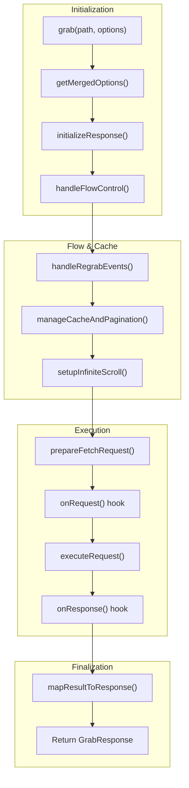
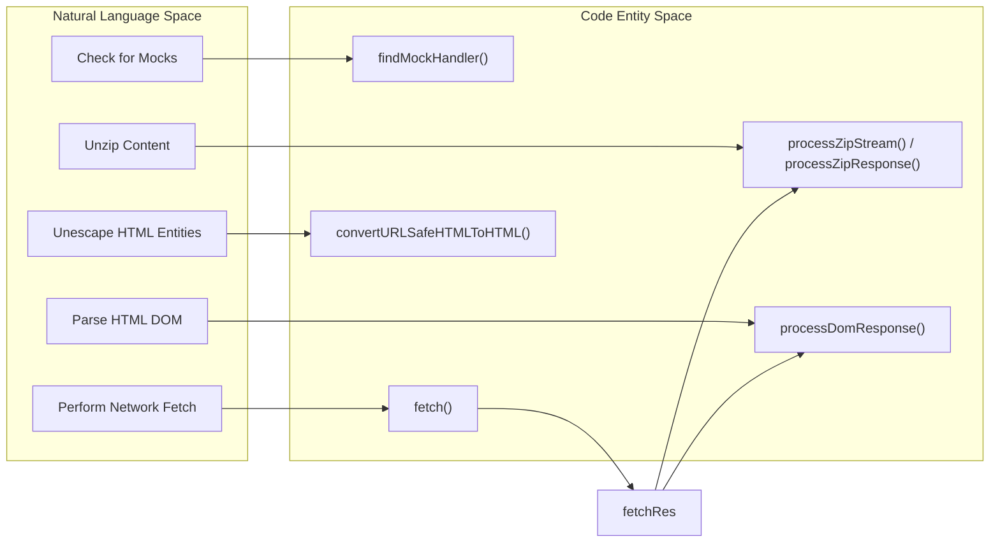

# Request Lifecycle & Core Engine
Relevant source files
- [docs/content/docs/Performance.mdx](https://github.com/vtempest/GRAB-URL/blob/a61acaf0/docs/content/docs/Performance.mdx?plain=1)
- [docs/content/docs/testing.mdx](https://github.com/vtempest/GRAB-URL/blob/a61acaf0/docs/content/docs/testing.mdx?plain=1)
- [packages/grab-api/src/common/utils.ts](https://github.com/vtempest/GRAB-URL/blob/a61acaf0/packages/grab-api/src/common/utils.ts)
- [packages/grab-api/src/core/cache-pagination.ts](https://github.com/vtempest/GRAB-URL/blob/a61acaf0/packages/grab-api/src/core/cache-pagination.ts)
- [packages/grab-api/src/core/core.ts](https://github.com/vtempest/GRAB-URL/blob/a61acaf0/packages/grab-api/src/core/core.ts)
- [packages/grab-api/src/core/flow-control.ts](https://github.com/vtempest/GRAB-URL/blob/a61acaf0/packages/grab-api/src/core/flow-control.ts)
- [packages/grab-api/src/core/regrab-events.ts](https://github.com/vtempest/GRAB-URL/blob/a61acaf0/packages/grab-api/src/core/regrab-events.ts)
- [packages/grab-api/src/core/request-executor-slim.ts](https://github.com/vtempest/GRAB-URL/blob/a61acaf0/packages/grab-api/src/core/request-executor-slim.ts)
- [packages/grab-api/src/core/request-executor.ts](https://github.com/vtempest/GRAB-URL/blob/a61acaf0/packages/grab-api/src/core/request-executor.ts)
- [packages/grab-api/src/core/request-prep.ts](https://github.com/vtempest/GRAB-URL/blob/a61acaf0/packages/grab-api/src/core/request-prep.ts)
- [packages/grab-api/src/devtools/devtools.ts](https://github.com/vtempest/GRAB-URL/blob/a61acaf0/packages/grab-api/src/devtools/devtools.ts)
- [packages/grab-api/src/response/response-handler.ts](https://github.com/vtempest/GRAB-URL/blob/a61acaf0/packages/grab-api/src/response/response-handler.ts)
- [packages/heyapi-client-grab/src/cli.ts](https://github.com/vtempest/GRAB-URL/blob/a61acaf0/packages/heyapi-client-grab/src/cli.ts)
- [test/grab.test.ts](https://github.com/vtempest/GRAB-URL/blob/a61acaf0/test/grab.test.ts)
- [tsconfig.json](https://github.com/vtempest/GRAB-URL/blob/a61acaf0/tsconfig.json)

This page details the internal execution flow of a `grab()` call, from the initial invocation to the final response mapping. The core engine coordinates option merging, flow control, cache management, and the underlying fetch execution.

## Overview of the Request Lifecycle

The lifecycle is orchestrated by the `createGrab` factory [packages/grab-api/src/core/core.ts30](https://github.com/vtempest/GRAB-URL/blob/a61acaf0/packages/grab-api/src/core/core.ts#L30-L30) which produces the main `grab()` function. The process follows a synchronous initialization phase followed by an asynchronous execution phase.

### Execution Flow Diagram

The following diagram illustrates the path a request takes through the `grab-api` core modules.

**Grab Request Pipeline**

**Sources:**[packages/grab-api/src/core/core.ts30-201](https://github.com/vtempest/GRAB-URL/blob/a61acaf0/packages/grab-api/src/core/core.ts#L30-L201)[packages/grab-api/src/core/flow-control.ts13-24](https://github.com/vtempest/GRAB-URL/blob/a61acaf0/packages/grab-api/src/core/flow-control.ts#L13-L24)

---

## 1. Option Merging & Initialization

Every `grab()` call begins by merging the provided `GrabOptions` with global defaults and instance-specific defaults.

- **Option Merging:**`getMergedOptions()` combines `window.grab.defaults` (or `globalThis` equivalent) with the current call's options [packages/grab-api/src/core/flow-control.ts13-24](https://github.com/vtempest/GRAB-URL/blob/a61acaf0/packages/grab-api/src/core/flow-control.ts#L13-L24)
- **URL Resolution:**`buildUrl()` resolves the `baseURL` and `path`, supporting both absolute URLs and relative paths [packages/grab-api/src/common/utils.ts70-84](https://github.com/vtempest/GRAB-URL/blob/a61acaf0/packages/grab-api/src/common/utils.ts#L70-L84)
- **Response Preparation:**`initializeResponse()` prepares the `GrabResponse` object. If the response is an object or a function, it is immediately set to an `isLoading: true` state [packages/grab-api/src/core/core.ts88-98](https://github.com/vtempest/GRAB-URL/blob/a61acaf0/packages/grab-api/src/core/core.ts#L88-L98)

**Sources:**[packages/grab-api/src/core/core.ts30-98](https://github.com/vtempest/GRAB-URL/blob/a61acaf0/packages/grab-api/src/core/core.ts#L30-L98)[packages/grab-api/src/core/flow-control.ts13-24](https://github.com/vtempest/GRAB-URL/blob/a61acaf0/packages/grab-api/src/core/flow-control.ts#L13-L24)[packages/grab-api/src/common/utils.ts70-84](https://github.com/vtempest/GRAB-URL/blob/a61acaf0/packages/grab-api/src/common/utils.ts#L70-L84)

---

## 2. Flow Control & Regrab Events

Before network execution, the engine evaluates flow control constraints such as debouncing and rate limiting.

### Flow Control Mechanisms

- **Debounce:** If `debounce` is set, the request is delayed using a timer. Subsequent calls to the same path will reset this timer via the `debouncer` utility [packages/grab-api/src/core/flow-control.ts38-44](https://github.com/vtempest/GRAB-URL/blob/a61acaf0/packages/grab-api/src/core/flow-control.ts#L38-L44)
- **Rate Limiting:** The engine checks `priorRequest.lastFetchTime` from `grab.log`. If the time elapsed is less than the `rateLimit` (in seconds), an error is thrown [packages/grab-api/src/core/core.ts129-136](https://github.com/vtempest/GRAB-URL/blob/a61acaf0/packages/grab-api/src/core/core.ts#L129-L136)
- **Cancellation:**
- `cancelOngoingIfNew`: Aborts previous requests to the same path using `AbortController.abort()`[packages/grab-api/src/core/core.ts139](https://github.com/vtempest/GRAB-URL/blob/a61acaf0/packages/grab-api/src/core/core.ts#L139-L139)
- `cancelNewIfOngoing`: Prevents a new request if one is already active by returning an early loading state [packages/grab-api/src/core/core.ts140](https://github.com/vtempest/GRAB-URL/blob/a61acaf0/packages/grab-api/src/core/core.ts#L140-L140)
- **Retry Logic:** If a request fails and `retryAttempts` is greater than zero, the `grab` function recursively calls itself, decrementing the attempt counter [packages/grab-api/src/core/core.ts219-224](https://github.com/vtempest/GRAB-URL/blob/a61acaf0/packages/grab-api/src/core/core.ts#L219-L224)

### Regrab Triggers

`handleRegrabEvents` attaches listeners for automatic re-fetching based on environmental triggers:

- **Stale Cache:** Refetches after `cacheForTime` expires using `setTimeout`[packages/grab-api/src/core/regrab-events.ts23](https://github.com/vtempest/GRAB-URL/blob/a61acaf0/packages/grab-api/src/core/regrab-events.ts#L23-L23)
- **Network Status:** Listens for the `online` event on the window [packages/grab-api/src/core/regrab-events.ts24](https://github.com/vtempest/GRAB-URL/blob/a61acaf0/packages/grab-api/src/core/regrab-events.ts#L24-L24)
- **Window Focus:** Listens for `focus` and `visibilitychange` to refresh data when the user returns to the tab [packages/grab-api/src/core/regrab-events.ts25-30](https://github.com/vtempest/GRAB-URL/blob/a61acaf0/packages/grab-api/src/core/regrab-events.ts#L25-L30)

**Sources:**[packages/grab-api/src/core/flow-control.ts29-70](https://github.com/vtempest/GRAB-URL/blob/a61acaf0/packages/grab-api/src/core/flow-control.ts#L29-L70)[packages/grab-api/src/core/regrab-events.ts12-31](https://github.com/vtempest/GRAB-URL/blob/a61acaf0/packages/grab-api/src/core/regrab-events.ts#L12-L31)[packages/grab-api/src/core/core.ts101-150](https://github.com/vtempest/GRAB-URL/blob/a61acaf0/packages/grab-api/src/core/core.ts#L101-L150)[packages/grab-api/src/core/core.ts219-224](https://github.com/vtempest/GRAB-URL/blob/a61acaf0/packages/grab-api/src/core/core.ts#L219-L224)

---

## 3. Cache & Pagination Management

The `manageCacheAndPagination` function handles frontend memory caching and state for infinite scrolling.

| Feature | Logic |
| --- | --- |
| **Cache Hit** | If `cache: true` and data is not stale, the engine retrieves the prior response from `grabLog`[packages/grab-api/src/core/core.ts116-123](https://github.com/vtempest/GRAB-URL/blob/a61acaf0/packages/grab-api/src/core/core.ts#L116-L123) |
| **Pagination** | If `infiniteScroll` is active, it handles page incrementing and injection of pagination parameters into the request [packages/grab-api/src/core/core.ts127](https://github.com/vtempest/GRAB-URL/blob/a61acaf0/packages/grab-api/src/core/core.ts#L127-L127) |

**Sources:**[packages/grab-api/src/core/core.ts111-127](https://github.com/vtempest/GRAB-URL/blob/a61acaf0/packages/grab-api/src/core/core.ts#L111-L127)[packages/grab-api/src/core/cache-pagination.ts1-20](https://github.com/vtempest/GRAB-URL/blob/a61acaf0/packages/grab-api/src/core/cache-pagination.ts#L1-L20)

---

## 4. Request Execution (`executeRequest`)

The `executeRequest` function is responsible for the actual `fetch` call and initial response processing. It also handles **Mocking**.

### Request Preparation

`prepareFetchRequest` transforms `GrabOptions` into standard `RequestInit` parameters:

- **Method Mapping:** Defaults to `GET`, or `POST/PUT/PATCH` if specific flags are set [packages/grab-api/src/core/core.ts39-45](https://github.com/vtempest/GRAB-URL/blob/a61acaf0/packages/grab-api/src/core/core.ts#L39-L45)
- **Headers:** Sets `Content-Type: application/json` and `Accept: application/json` by default [packages/grab-api/src/core/request-prep.ts19-21](https://github.com/vtempest/GRAB-URL/blob/a61acaf0/packages/grab-api/src/core/request-prep.ts#L19-L21)
- **Body Serialization:** Serializes the `body` for POST/PUT/PATCH requests. If `body` is undefined, it falls back to using the `params` object as the JSON body [packages/grab-api/src/core/request-prep.ts26-28](https://github.com/vtempest/GRAB-URL/blob/a61acaf0/packages/grab-api/src/core/request-prep.ts#L26-L28)
- **Timeout/Cancellation:** Attaches the `AbortSignal` for timeouts (via `AbortSignal.timeout`) and manual cancellation [packages/grab-api/src/core/core.ts143-149](https://github.com/vtempest/GRAB-URL/blob/a61acaf0/packages/grab-api/src/core/core.ts#L143-L149)

### Execution Logic Space

This diagram maps high-level concepts to the internal entities in `request-executor.ts`.

**Request Executor Mapping**

- **Mock Interception:** If a handler exists in `grab.mock` matching the path and parameters, it returns the mock response after a simulated `delay`[packages/grab-api/src/core/request-executor.ts32-37](https://github.com/vtempest/GRAB-URL/blob/a61acaf0/packages/grab-api/src/core/request-executor.ts#L32-L37)
- **Content-Type Detection:** The engine inspects headers to automatically trigger processors for `application/json`, `application/zip`, or `text/html`[packages/grab-api/src/core/request-executor.ts49-54](https://github.com/vtempest/GRAB-URL/blob/a61acaf0/packages/grab-api/src/core/request-executor.ts#L49-L54)
- **Streaming:** If `onStream` is provided, the `fetchRes.body` is passed directly to the callback [packages/grab-api/src/core/request-executor.ts70-73](https://github.com/vtempest/GRAB-URL/blob/a61acaf0/packages/grab-api/src/core/request-executor.ts#L70-L73)
- **Slim Executor:** A lighter version of the executor exists for slim builds (`request-executor-slim.ts`), which omits ZIP and DOM processing logic [packages/grab-api/src/core/request-executor-slim.ts12-73](https://github.com/vtempest/GRAB-URL/blob/a61acaf0/packages/grab-api/src/core/request-executor-slim.ts#L12-L73)

**Sources:**[packages/grab-api/src/core/request-executor.ts16-100](https://github.com/vtempest/GRAB-URL/blob/a61acaf0/packages/grab-api/src/core/request-executor.ts#L16-L100)[packages/grab-api/src/core/request-executor-slim.ts12-73](https://github.com/vtempest/GRAB-URL/blob/a61acaf0/packages/grab-api/src/core/request-executor-slim.ts#L12-L73)[packages/grab-api/src/core/request-prep.ts7-40](https://github.com/vtempest/GRAB-URL/blob/a61acaf0/packages/grab-api/src/core/request-prep.ts#L7-L40)[packages/grab-api/src/common/utils.ts99-104](https://github.com/vtempest/GRAB-URL/blob/a61acaf0/packages/grab-api/src/common/utils.ts#L99-L104)

---

## 5. Response Mapping & Hooks

Once data is returned from the executor, the engine performs final transformations and logging.

- **Hooks:**
- `onRequest`: Allows modification of path, response, params, and fetch options before execution [packages/grab-api/src/core/core.ts167-171](https://github.com/vtempest/GRAB-URL/blob/a61acaf0/packages/grab-api/src/core/core.ts#L167-L171)
- `onResponse`: Allows post-processing of the data before it is returned to the caller [packages/grab-api/src/core/core.ts192-196](https://github.com/vtempest/GRAB-URL/blob/a61acaf0/packages/grab-api/src/core/core.ts#L192-L196)
- **Result Mapping:**`mapResultToResponse` merges the raw data into the reactive `GrabResponse` object. For `infiniteScroll`, it concatenates the new results to the existing array if the key matches `paginateResult`[packages/grab-api/src/core/core.ts209](https://github.com/vtempest/GRAB-URL/blob/a61acaf0/packages/grab-api/src/core/core.ts#L209-L209)
- **Logging:** In debug mode, the engine logs the URL, options, elapsed time, and response structure using `printJSONStructure`[packages/grab-api/src/core/core.ts202-206](https://github.com/vtempest/GRAB-URL/blob/a61acaf0/packages/grab-api/src/core/core.ts#L202-L206)
- **Error Handling:** If the request fails, the `onError` hook is called [packages/grab-api/src/core/core.ts216-217](https://github.com/vtempest/GRAB-URL/blob/a61acaf0/packages/grab-api/src/core/core.ts#L216-L217)

**Sources:**[packages/grab-api/src/core/core.ts167-217](https://github.com/vtempest/GRAB-URL/blob/a61acaf0/packages/grab-api/src/core/core.ts#L167-L217)[packages/grab-api/src/response/response-handler.ts1-20](https://github.com/vtempest/GRAB-URL/blob/a61acaf0/packages/grab-api/src/response/response-handler.ts#L1-L20)