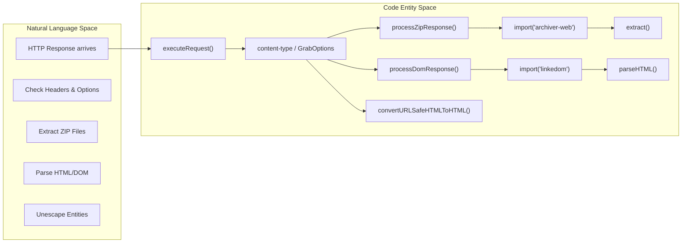
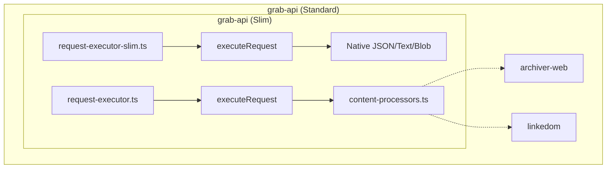

# Content Processors: ZIP, DOM & HTML
Relevant source files
- [dist/grab-api.cjs.js](https://github.com/vtempest/GRAB-URL/blob/a61acaf0/dist/grab-api.cjs.js)
- [dist/grab-api.cjs.js.map](https://github.com/vtempest/GRAB-URL/blob/a61acaf0/dist/grab-api.cjs.js.map)
- [dist/grab-api.es.js](https://github.com/vtempest/GRAB-URL/blob/a61acaf0/dist/grab-api.es.js)
- [dist/grab-api.es.js.map](https://github.com/vtempest/GRAB-URL/blob/a61acaf0/dist/grab-api.es.js.map)
- [dist/grab-api/common/types.d.ts](https://github.com/vtempest/GRAB-URL/blob/a61acaf0/dist/grab-api/common/types.d.ts)
- [docs/content/docs/testing.mdx](https://github.com/vtempest/GRAB-URL/blob/a61acaf0/docs/content/docs/testing.mdx?plain=1)
- [packages/archiver-web/tsconfig.json](https://github.com/vtempest/GRAB-URL/blob/a61acaf0/packages/archiver-web/tsconfig.json)
- [packages/grab-api/src/common/utils.ts](https://github.com/vtempest/GRAB-URL/blob/a61acaf0/packages/grab-api/src/common/utils.ts)
- [packages/grab-api/src/core/content-processors.ts](https://github.com/vtempest/GRAB-URL/blob/a61acaf0/packages/grab-api/src/core/content-processors.ts)
- [packages/grab-api/src/core/request-executor-slim.ts](https://github.com/vtempest/GRAB-URL/blob/a61acaf0/packages/grab-api/src/core/request-executor-slim.ts)
- [packages/grab-api/src/core/request-executor.ts](https://github.com/vtempest/GRAB-URL/blob/a61acaf0/packages/grab-api/src/core/request-executor.ts)
- [packages/grab-api/src/index.slim.ts](https://github.com/vtempest/GRAB-URL/blob/a61acaf0/packages/grab-api/src/index.slim.ts)
- [packages/grab-url-cli/src/display/spinner-config.ts](https://github.com/vtempest/GRAB-URL/blob/a61acaf0/packages/grab-url-cli/src/display/spinner-config.ts)
- [packages/grab-url-cli/src/download-spinners.ts](https://github.com/vtempest/GRAB-URL/blob/a61acaf0/packages/grab-url-cli/src/download-spinners.ts)
- [packages/grab-url-cli/src/index.ts](https://github.com/vtempest/GRAB-URL/blob/a61acaf0/packages/grab-url-cli/src/index.ts)
- [test/grab.test.ts](https://github.com/vtempest/GRAB-URL/blob/a61acaf0/test/grab.test.ts)

The `grab()` engine includes specialized processors for handling complex response types beyond standard JSON or plain text. It features an auto-detection system that triggers archive extraction, DOM parsing, or HTML entity unescaping based on response headers or explicit user options. To maintain a small core footprint, these "heavy" processors are dynamically imported only when needed or excluded entirely in the "slim" build.

## Automatic Content Detection

The `executeRequest` function analyzes the `content-type` header of the fetch response to determine which processor to invoke. This behavior can be overridden or forced using the `unzip`, `parseDOM` (aliased as `dom` in some builds), and `unescapeHTML` fields in `GrabOptions`[packages/grab-api/src/common/types.d.ts59-62](https://github.com/vtempest/GRAB-URL/blob/a61acaf0/packages/grab-api/src/common/types.d.ts#L59-L62)

### Detection Logic Table

| Content-Type | Option Trigger | Internal Processor | Dependency |
| --- | --- | --- | --- |
| `application/zip`, `application/x-zip` | `unzip: true` | `processZipResponse` | `archiver-web` |
| `text/html` | `parseDOM: string \| true` | `processDomResponse` | `linkedom` |
| Text with `&...;` entities | `unescapeHTML: true` | `convertURLSafeHTMLToHTML` | Native Utility |
| `application/json` | N/A | `fetchRes.json()` | Native |
| `application/pdf`, `application/octet-stream` | N/A | `fetchRes.blob()` | Native |

Sources: [packages/grab-api/src/core/request-executor.ts49-54](https://github.com/vtempest/GRAB-URL/blob/a61acaf0/packages/grab-api/src/core/request-executor.ts#L49-L54)[packages/grab-api/src/common/types.d.ts59-62](https://github.com/vtempest/GRAB-URL/blob/a61acaf0/packages/grab-api/src/common/types.d.ts#L59-L62)[packages/grab-api/src/common/utils.ts114-116](https://github.com/vtempest/GRAB-URL/blob/a61acaf0/packages/grab-api/src/common/utils.ts#L114-L116)[dist/grab-api.es.js1](https://github.com/vtempest/GRAB-URL/blob/a61acaf0/dist/grab-api.es.js#L1-L1)

## ZIP Archive Processing

When a ZIP response is detected, `grab()` consumes the response and passes it to the `processZipResponse` or `processZipStream` function [packages/grab-api/src/core/request-executor.ts56-67](https://github.com/vtempest/GRAB-URL/blob/a61acaf0/packages/grab-api/src/core/request-executor.ts#L56-L67)

### Implementation Detail

1. **Dynamic Import**: The `archiver-web` package is imported at runtime using `await import("archiver-web")` to keep the initial bundle size low [dist/grab-api.es.js.map1](https://github.com/vtempest/GRAB-URL/blob/a61acaf0/dist/grab-api.es.js.map#L1-L1)
2. **Extraction**: The `extract` function from `archiver-web` processes the buffer [dist/grab-api.es.js.map1](https://github.com/vtempest/GRAB-URL/blob/a61acaf0/dist/grab-api.es.js.map#L1-L1)
3. **Mapping**: The resulting file list is transformed into a key-value record where keys are file paths (`file.path`) and values are file contents (`file.content`) [dist/grab-api.es.js.map1](https://github.com/vtempest/GRAB-URL/blob/a61acaf0/dist/grab-api.es.js.map#L1-L1)

### Streaming Extraction

For large archives, `processZipStream` allows for "instant unzip" by processing the `ReadableStream` as chunks arrive. If an `onStream` callback is provided, it receives each extracted file the moment it is available [packages/grab-api/src/core/request-executor.ts57-64](https://github.com/vtempest/GRAB-URL/blob/a61acaf0/packages/grab-api/src/core/request-executor.ts#L57-L64)

Sources: [packages/grab-api/src/core/request-executor.ts56-67](https://github.com/vtempest/GRAB-URL/blob/a61acaf0/packages/grab-api/src/core/request-executor.ts#L56-L67)[dist/grab-api.es.js.map1](https://github.com/vtempest/GRAB-URL/blob/a61acaf0/dist/grab-api.es.js.map#L1-L1)[dist/grab-api.es.js1](https://github.com/vtempest/GRAB-URL/blob/a61acaf0/dist/grab-api.es.js#L1-L1)

## DOM & HTML Processing

The HTML processor allows `grab()` to act as a lightweight scraper by converting HTML strings into traversable DOM structures using `linkedom`.

### Functionality of `processDomResponse`

- **Dynamic Import**: Imports `linkedom` only when an HTML response needs parsing [dist/grab-api.es.js.map1](https://github.com/vtempest/GRAB-URL/blob/a61acaf0/dist/grab-api.es.js.map#L1-L1)
- **Full Document**: If the `parseDOM` option (or `dom` in the executor) is set to `true`, the function returns a full `linkedom` Document object [dist/grab-api.es.js.map1](https://github.com/vtempest/GRAB-URL/blob/a61acaf0/dist/grab-api.es.js.map#L1-L1)
- **Selector Extraction**: If a string CSS selector is provided, it uses `document.querySelector()` to isolate a specific element [dist/grab-api.es.js.map1](https://github.com/vtempest/GRAB-URL/blob/a61acaf0/dist/grab-api.es.js.map#L1-L1)
- **Content Recovery**: It returns the `innerHTML` or `textContent` of the selected element, or `null` if not found [dist/grab-api.es.js.map1](https://github.com/vtempest/GRAB-URL/blob/a61acaf0/dist/grab-api.es.js.map#L1-L1)

Sources: [packages/grab-api/src/core/request-executor.ts75-78](https://github.com/vtempest/GRAB-URL/blob/a61acaf0/packages/grab-api/src/core/request-executor.ts#L75-L78)[dist/grab-api.es.js.map1](https://github.com/vtempest/GRAB-URL/blob/a61acaf0/dist/grab-api.es.js.map#L1-L1)[dist/grab-api.es.js1](https://github.com/vtempest/GRAB-URL/blob/a61acaf0/dist/grab-api.es.js#L1-L1)

## HTML Entity Unescaping

`grab()` includes a utility to convert URL-safe escaped HTML codes (like `&amp;`, `&#39;`, or `&rsquo;`) back to standard characters. This is auto-applied only when entities are detected in a string response [packages/grab-api/src/core/request-executor.ts94-97](https://github.com/vtempest/GRAB-URL/blob/a61acaf0/packages/grab-api/src/core/request-executor.ts#L94-L97)

### Logic Flow

1. **Detection**: `hasHTMLEntities` uses a regex `/&(?:[a-zA-Z][a-zA-Z0-9]+|#\d+|#x[0-9a-fA-F]+);/` to check for named or numeric entities [packages/grab-api/src/common/utils.ts114-116](https://github.com/vtempest/GRAB-URL/blob/a61acaf0/packages/grab-api/src/common/utils.ts#L114-L116)
2. **Conversion**: `convertURLSafeHTMLToHTML` uses an `entityMap` containing common entities like `&quot;`, `&euro;`, and `&copy;`[packages/grab-api/src/common/utils.ts131-151](https://github.com/vtempest/GRAB-URL/blob/a61acaf0/packages/grab-api/src/common/utils.ts#L131-L151)
3. **Numeric Handling**: It supports hexadecimal (`&#x...;`) and decimal (`&#...;`) numeric references via `String.fromCharCode` and `parseInt`[packages/grab-api/src/common/utils.ts171-180](https://github.com/vtempest/GRAB-URL/blob/a61acaf0/packages/grab-api/src/common/utils.ts#L171-L180)

Sources: [packages/grab-api/src/common/utils.ts114-190](https://github.com/vtempest/GRAB-URL/blob/a61acaf0/packages/grab-api/src/common/utils.ts#L114-L190)[packages/grab-api/src/core/request-executor.ts94-97](https://github.com/vtempest/GRAB-URL/blob/a61acaf0/packages/grab-api/src/core/request-executor.ts#L94-L97)

## Code Entity Mapping: Content Flow

This diagram illustrates how a raw `fetch` response is routed through the `executeRequest` logic into specific processor functions.

**Data Routing Architecture**

Sources: [dist/grab-api.es.js.map1](https://github.com/vtempest/GRAB-URL/blob/a61acaf0/dist/grab-api.es.js.map#L1-L1)[packages/grab-api/src/core/request-executor.ts16-100](https://github.com/vtempest/GRAB-URL/blob/a61acaf0/packages/grab-api/src/core/request-executor.ts#L16-L100)[packages/grab-api/src/common/utils.ts130-131](https://github.com/vtempest/GRAB-URL/blob/a61acaf0/packages/grab-api/src/common/utils.ts#L130-L131)[dist/grab-api.es.js1](https://github.com/vtempest/GRAB-URL/blob/a61acaf0/dist/grab-api.es.js#L1-L1)

## The Slim Build Strategy

The monorepo provides a "slim" variant in `packages/grab-api/src/core/request-executor-slim.ts`. This version is designed for environments where bundle size is critical and ZIP/DOM processing is not required.

### Differences in Slim Build

- **Dependency Exclusion**: The slim build removes the imports and logic for `archiver-web` and `linkedom`, preventing them from being bundled even as lazy-loaded chunks [packages/grab-api/src/core/request-executor-slim.ts3-5](https://github.com/vtempest/GRAB-URL/blob/a61acaf0/packages/grab-api/src/core/request-executor-slim.ts#L3-L5)
- **Native Parsing**: In the absence of processors, the engine falls back to native `fetchRes.json()`, `fetchRes.blob()`, or `fetchRes.text()`. ZIP files are treated as standard `blob()` responses in the slim build [packages/grab-api/src/core/request-executor-slim.ts52-63](https://github.com/vtempest/GRAB-URL/blob/a61acaf0/packages/grab-api/src/core/request-executor-slim.ts#L52-L63)

**Build Variant Comparison**

Sources: [packages/grab-api/src/core/request-executor.ts1-100](https://github.com/vtempest/GRAB-URL/blob/a61acaf0/packages/grab-api/src/core/request-executor.ts#L1-L100)[packages/grab-api/src/core/request-executor-slim.ts1-73](https://github.com/vtempest/GRAB-URL/blob/a61acaf0/packages/grab-api/src/core/request-executor-slim.ts#L1-L73)

## Key Functions Reference

### `processZipResponse(buffer)`

- **File**: `packages/grab-api/core/content-processors.ts` (Referenced in [dist/grab-api.es.js.map1](https://github.com/vtempest/GRAB-URL/blob/a61acaf0/dist/grab-api.es.js.map#L1-L1))
- **Input**: `ArrayBuffer`
- **Output**: `Promise<Record<string, string>>`
- **Role**: Converts a binary ZIP buffer into a flat object of file paths and string contents using `archiver-web`.

### `processDomResponse(html, selector)`

- **File**: `packages/grab-api/core/content-processors.ts` (Referenced in [dist/grab-api.es.js.map1](https://github.com/vtempest/GRAB-URL/blob/a61acaf0/dist/grab-api.es.js.map#L1-L1))
- **Input**: `html: string`, `selector: string | boolean`
- **Output**: `Promise<any>`
- **Role**: Parses HTML strings via `linkedom`; returns either a Document object or specific element content based on the provided CSS selector.

### `convertURLSafeHTMLToHTML(str, toStandardHTML)`

- **File**: `packages/grab-api/src/common/utils.ts`[130-190](https://github.com/vtempest/GRAB-URL/blob/a61acaf0/130-190)
- **Input**: `str: string`, `toStandardHTML: boolean`
- **Output**: `string`
- **Role**: Decodes HTML entities into standard characters or encodes standard characters into entities.

Sources: [dist/grab-api.es.js.map1](https://github.com/vtempest/GRAB-URL/blob/a61acaf0/dist/grab-api.es.js.map#L1-L1)[packages/grab-api/src/common/utils.ts130-190](https://github.com/vtempest/GRAB-URL/blob/a61acaf0/packages/grab-api/src/common/utils.ts#L130-L190)[packages/grab-api/src/core/request-executor.ts16-100](https://github.com/vtempest/GRAB-URL/blob/a61acaf0/packages/grab-api/src/core/request-executor.ts#L16-L100)