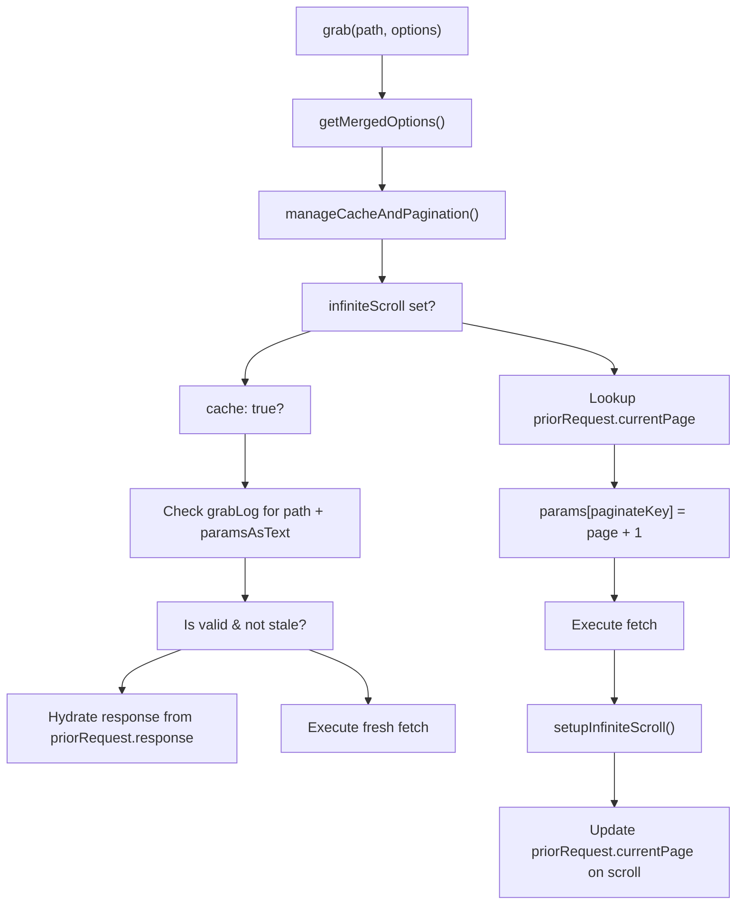
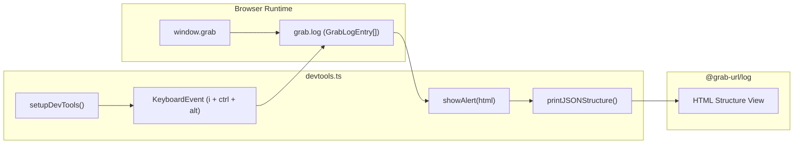

# Caching, Regrab Events & Infinite Scroll
Relevant source files
- [packages/grab-api/src/core/cache-pagination.ts](https://github.com/vtempest/GRAB-URL/blob/a61acaf0/packages/grab-api/src/core/cache-pagination.ts)
- [packages/grab-api/src/core/flow-control.ts](https://github.com/vtempest/GRAB-URL/blob/a61acaf0/packages/grab-api/src/core/flow-control.ts)
- [packages/grab-api/src/core/regrab-events.ts](https://github.com/vtempest/GRAB-URL/blob/a61acaf0/packages/grab-api/src/core/regrab-events.ts)
- [packages/grab-api/src/devtools/devtools.ts](https://github.com/vtempest/GRAB-URL/blob/a61acaf0/packages/grab-api/src/devtools/devtools.ts)
- [packages/grab-api/src/response/infinite-scroll.ts](https://github.com/vtempest/GRAB-URL/blob/a61acaf0/packages/grab-api/src/response/infinite-scroll.ts)
- [packages/grab-api/src/response/response-handler.ts](https://github.com/vtempest/GRAB-URL/blob/a61acaf0/packages/grab-api/src/response/response-handler.ts)

The `grab()` library provides a sophisticated frontend state management layer that extends beyond simple HTTP requests. It includes a built-in memory cache, automatic re-fetching triggers (regrab events), and an infinite scroll subsystem that handles data merging and scroll position preservation.

## Frontend Memory Cache

`grab()` maintains a global request log in `grab.log` which serves as the primary memory cache for GET requests. When the `cache` option is enabled, the system checks this log for existing responses matching the same path and parameters.

### Cache Hit Logic

The `manageCacheAndPagination` function determines if a request can be served from the cache based on the following criteria:

1. **Key Matching**: The request path and stringified parameters must match a prior entry [packages/grab-api/src/core/cache-pagination.ts25](https://github.com/vtempest/GRAB-URL/blob/a61acaf0/packages/grab-api/src/core/cache-pagination.ts#L25-L25)
2. **Stale Check**: If `cacheForTime` is provided, the cached entry must be younger than the specified duration (defaulting to 60 seconds if used with regrab events) [packages/grab-api/src/core/cache-pagination.ts32-33](https://github.com/vtempest/GRAB-URL/blob/a61acaf0/packages/grab-api/src/core/cache-pagination.ts#L32-L33)
3. **State Hydration**: On a hit, the library reactively updates the provided `response` object properties rather than replacing the object reference, ensuring UI frameworks (React, Vue, Svelte) detect the change [packages/grab-api/src/core/cache-pagination.ts34-36](https://github.com/vtempest/GRAB-URL/blob/a61acaf0/packages/grab-api/src/core/cache-pagination.ts#L34-L36)

### Regrab Triggers

Regrab events allow `grab()` to automatically refresh data in the background based on environmental triggers. These are handled by `handleRegrabEvents`[packages/grab-api/src/core/regrab-events.ts12-17](https://github.com/vtempest/GRAB-URL/blob/a61acaf0/packages/grab-api/src/core/regrab-events.ts#L12-L17)

| Option | Trigger | Implementation |
| --- | --- | --- |
| `regrabOnStale` | Time-based | Uses `setTimeout` based on `cacheForTime`[packages/grab-api/src/core/regrab-events.ts23](https://github.com/vtempest/GRAB-URL/blob/a61acaf0/packages/grab-api/src/core/regrab-events.ts#L23-L23) |
| `regrabOnFocus` | Window focus | Listens to `focus` and `visibilitychange` (visible) [packages/grab-api/src/core/regrab-events.ts25-30](https://github.com/vtempest/GRAB-URL/blob/a61acaf0/packages/grab-api/src/core/regrab-events.ts#L25-L30) |
| `regrabOnNetwork` | Network recovery | Listens to the `online` event [packages/grab-api/src/core/regrab-events.ts24](https://github.com/vtempest/GRAB-URL/blob/a61acaf0/packages/grab-api/src/core/regrab-events.ts#L24-L24) |

Sources: [packages/grab-api/src/core/cache-pagination.ts10-52](https://github.com/vtempest/GRAB-URL/blob/a61acaf0/packages/grab-api/src/core/cache-pagination.ts#L10-L52)[packages/grab-api/src/core/regrab-events.ts12-31](https://github.com/vtempest/GRAB-URL/blob/a61acaf0/packages/grab-api/src/core/regrab-events.ts#L12-L31)

## Infinite Scroll Subsystem

The infinite scroll feature is activated via the `infiniteScroll` option, which typically takes a tuple: `[paginateKey, paginateResult, paginateElement]`[packages/grab-api/src/core/cache-pagination.ts19](https://github.com/vtempest/GRAB-URL/blob/a61acaf0/packages/grab-api/src/core/cache-pagination.ts#L19-L19)

### Data Flow & Merging

Unlike standard requests that clear the `response` object before execution, infinite scroll mode preserves existing data and increments page counters.

1. **Page Management**: The system looks up the `priorRequest` in the log. If found, it increments `currentPage`; otherwise, it initializes the page to 1 [packages/grab-api/src/core/cache-pagination.ts41-49](https://github.com/vtempest/GRAB-URL/blob/a61acaf0/packages/grab-api/src/core/cache-pagination.ts#L41-L49)
2. **Parameter Injection**: The `paginateKey` (e.g., `"page"`) is automatically added to the request parameters with the new page number [packages/grab-api/src/core/cache-pagination.ts48](https://github.com/vtempest/GRAB-URL/blob/a61acaf0/packages/grab-api/src/core/cache-pagination.ts#L48-L48)
3. **Scroll Detection**: The `setupInfiniteScroll` function attaches a listener to the `paginateDOM`. When the user scrolls within 200px of the bottom, a new `grab()` call is triggered for the next page [packages/grab-api/src/response/infinite-scroll.ts52-58](https://github.com/vtempest/GRAB-URL/blob/a61acaf0/packages/grab-api/src/response/infinite-scroll.ts#L52-L58)
4. **Result Merging**: In `mapResultToResponse`, if the key matches `paginateResult`, the new data is appended to the existing array instead of overwriting it [packages/grab-api/src/response/response-handler.ts25-27](https://github.com/vtempest/GRAB-URL/blob/a61acaf0/packages/grab-api/src/response/response-handler.ts#L25-L27)
5. **Position Restoration**: Scroll coordinates are persisted to `localStorage` under the key `"scroll"`[packages/grab-api/src/response/infinite-scroll.ts47-50](https://github.com/vtempest/GRAB-URL/blob/a61acaf0/packages/grab-api/src/response/infinite-scroll.ts#L47-L50)

### Implementation Architecture

The following diagram illustrates how `manageCacheAndPagination` interacts with the `grabLog` and the `infiniteScroll` configuration.

**Cache and Pagination Logic Flow**

Sources: [packages/grab-api/src/core/cache-pagination.ts10-52](https://github.com/vtempest/GRAB-URL/blob/a61acaf0/packages/grab-api/src/core/cache-pagination.ts#L10-L52)[packages/grab-api/src/core/flow-control.ts13-24](https://github.com/vtempest/GRAB-URL/blob/a61acaf0/packages/grab-api/src/core/flow-control.ts#L13-L24)[packages/grab-api/src/response/infinite-scroll.ts13-65](https://github.com/vtempest/GRAB-URL/blob/a61acaf0/packages/grab-api/src/response/infinite-scroll.ts#L13-L65)[packages/grab-api/src/response/response-handler.ts22-38](https://github.com/vtempest/GRAB-URL/blob/a61acaf0/packages/grab-api/src/response/response-handler.ts#L22-L38)

## Visual Debugging with DevTools

The caching and request history can be inspected in real-time using the built-in DevTools.

### Activation

In browser environments, the DevTools are initialized via `setupDevTools()`[packages/grab-api/src/devtools/devtools.ts50-51](https://github.com/vtempest/GRAB-URL/blob/a61acaf0/packages/grab-api/src/devtools/devtools.ts#L50-L51) Users can trigger the overlay using the keyboard shortcut:

- **`Ctrl + Alt + I`**[packages/grab-api/src/devtools/devtools.ts58](https://github.com/vtempest/GRAB-URL/blob/a61acaf0/packages/grab-api/src/devtools/devtools.ts#L58-L58)

### Features

The DevTools overlay provides a deep look into the `grab.log`[packages/grab-api/src/devtools/devtools.ts60](https://github.com/vtempest/GRAB-URL/blob/a61acaf0/packages/grab-api/src/devtools/devtools.ts#L60-L60):

- **Request Structure**: Visualizes the parameters sent using `printJSONStructure`[packages/grab-api/src/devtools/devtools.ts62](https://github.com/vtempest/GRAB-URL/blob/a61acaf0/packages/grab-api/src/devtools/devtools.ts#L62-L62)
- **Response Structure**: Displays the shape of the returned data [packages/grab-api/src/devtools/devtools.ts63](https://github.com/vtempest/GRAB-URL/blob/a61acaf0/packages/grab-api/src/devtools/devtools.ts#L63-L63)
- **Raw Data**: Provides a scrollable JSON view of the actual response body [packages/grab-api/src/devtools/devtools.ts83](https://github.com/vtempest/GRAB-URL/blob/a61acaf0/packages/grab-api/src/devtools/devtools.ts#L83-L83)
- **Timestamping**: Shows exactly when each cached entry was last fetched [packages/grab-api/src/devtools/devtools.ts61](https://github.com/vtempest/GRAB-URL/blob/a61acaf0/packages/grab-api/src/devtools/devtools.ts#L61-L61)

**DevTools Entity Mapping**

Sources: [packages/grab-api/src/devtools/devtools.ts50-91](https://github.com/vtempest/GRAB-URL/blob/a61acaf0/packages/grab-api/src/devtools/devtools.ts#L50-L91)[packages/grab-api/src/core/cache-pagination.ts16](https://github.com/vtempest/GRAB-URL/blob/a61acaf0/packages/grab-api/src/core/cache-pagination.ts#L16-L16)

## Flow Control & Merging

Before caching or events are processed, `grab()` merges options and handles flow control like debouncing [packages/grab-api/src/core/flow-control.ts29-34](https://github.com/vtempest/GRAB-URL/blob/a61acaf0/packages/grab-api/src/core/flow-control.ts#L29-L34)

| Function | Role |
| --- | --- |
| `getMergedOptions` | Merges user options with `window.grab.defaults`[packages/grab-api/src/core/flow-control.ts13-24](https://github.com/vtempest/GRAB-URL/blob/a61acaf0/packages/grab-api/src/core/flow-control.ts#L13-L24) |
| `handleFlowControl` | Manages `debounce`, `repeat`, and `setDefaults` logic [packages/grab-api/src/core/flow-control.ts29-70](https://github.com/vtempest/GRAB-URL/blob/a61acaf0/packages/grab-api/src/core/flow-control.ts#L29-L70) |
| `initializeResponse` | Prepares the `response` object and result mapping function [packages/grab-api/src/response/response-handler.ts10-17](https://github.com/vtempest/GRAB-URL/blob/a61acaf0/packages/grab-api/src/response/response-handler.ts#L10-L17) |

Sources: [packages/grab-api/src/core/flow-control.ts13-70](https://github.com/vtempest/GRAB-URL/blob/a61acaf0/packages/grab-api/src/core/flow-control.ts#L13-L70)[packages/grab-api/src/response/response-handler.ts10-17](https://github.com/vtempest/GRAB-URL/blob/a61acaf0/packages/grab-api/src/response/response-handler.ts#L10-L17)