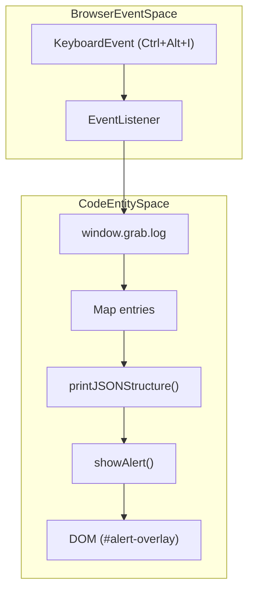

# DevTools, Mocking & Testing
Relevant source files
- [.github/workflows/tests.yml](https://github.com/vtempest/GRAB-URL/blob/a61acaf0/.github/workflows/tests.yml)
- [codecov.yml](https://github.com/vtempest/GRAB-URL/blob/a61acaf0/codecov.yml)
- [docs/content/docs/testing.mdx](https://github.com/vtempest/GRAB-URL/blob/a61acaf0/docs/content/docs/testing.mdx?plain=1)
- [packages/grab-api/src/common/utils.ts](https://github.com/vtempest/GRAB-URL/blob/a61acaf0/packages/grab-api/src/common/utils.ts)
- [packages/grab-api/src/core/cache-pagination.ts](https://github.com/vtempest/GRAB-URL/blob/a61acaf0/packages/grab-api/src/core/cache-pagination.ts)
- [packages/grab-api/src/core/flow-control.ts](https://github.com/vtempest/GRAB-URL/blob/a61acaf0/packages/grab-api/src/core/flow-control.ts)
- [packages/grab-api/src/core/regrab-events.ts](https://github.com/vtempest/GRAB-URL/blob/a61acaf0/packages/grab-api/src/core/regrab-events.ts)
- [packages/grab-api/src/core/request-executor-slim.ts](https://github.com/vtempest/GRAB-URL/blob/a61acaf0/packages/grab-api/src/core/request-executor-slim.ts)
- [packages/grab-api/src/core/request-executor.ts](https://github.com/vtempest/GRAB-URL/blob/a61acaf0/packages/grab-api/src/core/request-executor.ts)
- [packages/grab-api/src/devtools/devtools.ts](https://github.com/vtempest/GRAB-URL/blob/a61acaf0/packages/grab-api/src/devtools/devtools.ts)
- [smoke.mjs](https://github.com/vtempest/GRAB-URL/blob/a61acaf0/smoke.mjs)
- [test/command.test.ts](https://github.com/vtempest/GRAB-URL/blob/a61acaf0/test/command.test.ts)
- [test/grab.test.ts](https://github.com/vtempest/GRAB-URL/blob/a61acaf0/test/grab.test.ts)
- [vite.config.ts](https://github.com/vtempest/GRAB-URL/blob/a61acaf0/vite.config.ts)

This section details the internal mechanisms for debugging, intercepting, and verifying requests within the `grab-url` ecosystem. It covers the browser-based DevTools overlay, the built-in mocking engine for unit tests, and the request logging system.

## In-Browser DevTools

The `grab-url` library includes a built-in DevTools overlay designed for rapid debugging without opening the browser's native network tab. It provides a structural visualization of every request and response processed by the `grab()` engine.

### Activation & UI

The DevTools are initialized via `setupDevTools()`[packages/grab-api/src/devtools/devtools.ts50](https://github.com/vtempest/GRAB-URL/blob/a61acaf0/packages/grab-api/src/devtools/devtools.ts#L50-L50) When running in a browser environment, it listens for the global keyboard shortcut **Ctrl+Alt+I**[packages/grab-api/src/devtools/devtools.ts58](https://github.com/vtempest/GRAB-URL/blob/a61acaf0/packages/grab-api/src/devtools/devtools.ts#L58-L58) The system uses `isLocalhost()` to ensure these tools are primarily active in development environments [packages/grab-api/src/common/utils.ts46-61](https://github.com/vtempest/GRAB-URL/blob/a61acaf0/packages/grab-api/src/common/utils.ts#L46-L61)

The overlay uses a non-blocking modal system implemented in `showAlert()`[packages/grab-api/src/devtools/devtools.ts16](https://github.com/vtempest/GRAB-URL/blob/a61acaf0/packages/grab-api/src/devtools/devtools.ts#L16-L16) It iterates through the `grab.log` history and renders:

- **Path & Timestamp**: The endpoint requested and the local time of execution [packages/grab-api/src/devtools/devtools.ts69-70](https://github.com/vtempest/GRAB-URL/blob/a61acaf0/packages/grab-api/src/devtools/devtools.ts#L69-L70)
- **Request Structure**: A type-outline of the parameters sent, generated by `printJSONStructure`[packages/grab-api/src/devtools/devtools.ts62](https://github.com/vtempest/GRAB-URL/blob/a61acaf0/packages/grab-api/src/devtools/devtools.ts#L62-L62)
- **Response Structure**: A structural map of the returned JSON [packages/grab-api/src/devtools/devtools.ts63](https://github.com/vtempest/GRAB-URL/blob/a61acaf0/packages/grab-api/src/devtools/devtools.ts#L63-L63)
- **Raw Data**: The full, escaped JSON response body [packages/grab-api/src/devtools/devtools.ts64](https://github.com/vtempest/GRAB-URL/blob/a61acaf0/packages/grab-api/src/devtools/devtools.ts#L64-L64)

### DevTools Logic Flow

Title: "DevTools Event and Rendering Flow"



Sources: [packages/grab-api/src/devtools/devtools.ts50-91](https://github.com/vtempest/GRAB-URL/blob/a61acaf0/packages/grab-api/src/devtools/devtools.ts#L50-L91)[packages/grab-api/src/devtools/devtools.ts16-40](https://github.com/vtempest/GRAB-URL/blob/a61acaf0/packages/grab-api/src/devtools/devtools.ts#L16-L40)[packages/grab-api/src/common/utils.ts46-61](https://github.com/vtempest/GRAB-URL/blob/a61acaf0/packages/grab-api/src/common/utils.ts#L46-L61)

---

## Mocking System

The `grab.mock` object allows developers to intercept network requests and return simulated data. This is integrated directly into the `executeRequest` lifecycle [packages/grab-api/src/core/request-executor.ts28-37](https://github.com/vtempest/GRAB-URL/blob/a61acaf0/packages/grab-api/src/core/request-executor.ts#L28-L37)

### Interception Logic

When `grab()` is called, the `executeRequest` function (or its slim variant) calls `findMockHandler` to check for registered intercepts [packages/grab-api/src/core/request-executor.ts29](https://github.com/vtempest/GRAB-URL/blob/a61acaf0/packages/grab-api/src/core/request-executor.ts#L29-L29) Paths are normalized so that keys with or without leading slashes match correctly [packages/grab-api/src/common/utils.ts99-104](https://github.com/vtempest/GRAB-URL/blob/a61acaf0/packages/grab-api/src/common/utils.ts#L99-L104)

| Mock Type | Implementation | Description |
| --- | --- | --- |
| **Static Mock** | `grab.mock['path'] = { response: { data } }` | Returns the object directly without hitting the network [test/grab.test.ts140-145](https://github.com/vtempest/GRAB-URL/blob/a61acaf0/test/grab.test.ts#L140-L145) |
| **Functional Mock** | `grab.mock['path'] = { response: (params) => { ... } }` | Receives the request parameters and returns a dynamic response [test/grab.test.ts147-154](https://github.com/vtempest/GRAB-URL/blob/a61acaf0/test/grab.test.ts#L147-L154) |
| **Error Simulation** | `grab.mock['path'] = { response: () => { throw new Error() } }` | Simulates network or server failures [test/grab.test.ts156-162](https://github.com/vtempest/GRAB-URL/blob/a61acaf0/test/grab.test.ts#L156-L162) |
| **Delayed Mock** | `grab.mock['path'] = { delay: 2, response: {} }` | Uses `wait(delay)` to simulate network latency [packages/grab-api/src/core/request-executor.ts31](https://github.com/vtempest/GRAB-URL/blob/a61acaf0/packages/grab-api/src/core/request-executor.ts#L31-L31) |

### Mock Registry Data Flow

Title: "Request Interception Mechanism"

```

```

Sources: [packages/grab-api/src/core/request-executor.ts12-37](https://github.com/vtempest/GRAB-URL/blob/a61acaf0/packages/grab-api/src/core/request-executor.ts#L12-L37)[packages/grab-api/src/common/utils.ts89-104](https://github.com/vtempest/GRAB-URL/blob/a61acaf0/packages/grab-api/src/common/utils.ts#L89-L104)[test/grab.test.ts139-173](https://github.com/vtempest/GRAB-URL/blob/a61acaf0/test/grab.test.ts#L139-L173)

---

## Request History (grab.log)

The `grab.log` array acts as an in-memory database of all transactions performed during the session.

### Entry Schema

Each entry in `grab.log` follows a specific structure used by both the DevTools and the cache management system:

- `path`: The target URL or endpoint [packages/grab-api/src/devtools/devtools.ts69](https://github.com/vtempest/GRAB-URL/blob/a61acaf0/packages/grab-api/src/devtools/devtools.ts#L69-L69)
- `request`: The parameters used for the call [packages/grab-api/src/devtools/devtools.ts62](https://github.com/vtempest/GRAB-URL/blob/a61acaf0/packages/grab-api/src/devtools/devtools.ts#L62-L62)
- `response`: The data returned by the server or mock [packages/grab-api/src/devtools/devtools.ts63-64](https://github.com/vtempest/GRAB-URL/blob/a61acaf0/packages/grab-api/src/devtools/devtools.ts#L63-L64)
- `lastFetchTime`: Timestamp used for history visualization [packages/grab-api/src/devtools/devtools.ts61](https://github.com/vtempest/GRAB-URL/blob/a61acaf0/packages/grab-api/src/devtools/devtools.ts#L61-L61)

### Cache Integration

While `grab.log` provides the visual history, the core engine uses internal structures for cache management. If `cache: true` is set in `GrabOptions`, the engine searches for matching paths and parameters before initiating `executeRequest`[packages/grab-api/src/core/request-executor.ts28-37](https://github.com/vtempest/GRAB-URL/blob/a61acaf0/packages/grab-api/src/core/request-executor.ts#L28-L37)

Sources: [packages/grab-api/src/devtools/devtools.ts50-91](https://github.com/vtempest/GRAB-URL/blob/a61acaf0/packages/grab-api/src/devtools/devtools.ts#L50-L91)[packages/grab-api/src/core/request-executor.ts16-37](https://github.com/vtempest/GRAB-URL/blob/a61acaf0/packages/grab-api/src/core/request-executor.ts#L16-L37)

---

## Testing with Vitest

Testing is centralized using Vitest as the test runner [vite.config.ts113-131](https://github.com/vtempest/GRAB-URL/blob/a61acaf0/vite.config.ts#L113-L131) The monorepo configuration includes V8 coverage reporting [vite.config.ts114-117](https://github.com/vtempest/GRAB-URL/blob/a61acaf0/vite.config.ts#L114-L117)

### Unit Testing grab()

Tests typically stub the global `fetch` via `vi.stubGlobal('fetch', ...)` to verify that `grab()` correctly formats requests and processes responses [test/grab.test.ts12-28](https://github.com/vtempest/GRAB-URL/blob/a61acaf0/test/grab.test.ts#L12-L28)

```
// Example from test/grab.test.ts
it('sends POST when post:true is set', async () => {
  mockOk({ created: true });
  await grab('users', { post: true, name: 'Bob' });
  const [, options] = mockFetch.mock.calls[0];
  expect(options.method).toBe('POST');
  expect(JSON.parse(options.body).name).toBe('Bob');
});
```

Sources: [test/grab.test.ts66-76](https://github.com/vtempest/GRAB-URL/blob/a61acaf0/test/grab.test.ts#L66-L76)[vite.config.ts113-131](https://github.com/vtempest/GRAB-URL/blob/a61acaf0/vite.config.ts#L113-L131)

### Integration Testing the CLI

For the `grab-url-cli` package, tests spin up a local `http.Server` via `http.createServer` to verify multi-file concurrent downloads and range-request (resume) logic [test/command.test.ts23-85](https://github.com/vtempest/GRAB-URL/blob/a61acaf0/test/command.test.ts#L23-L85)

Key verification points in CLI tests:

- **Concurrent Downloads**: Ensuring `MultiColorFileDownloaderCLI` handles multiple files simultaneously via `downloadMultipleFiles`[test/command.test.ts114-126](https://github.com/vtempest/GRAB-URL/blob/a61acaf0/test/command.test.ts#L114-L126)
- **Resilience**: Verifying that a 404 on one file does not abort the entire queue [test/command.test.ts128-138](https://github.com/vtempest/GRAB-URL/blob/a61acaf0/test/command.test.ts#L128-L138)
- **Pause/Resume State**: Checking `pauseAll()` and `resumeAll()` behavior [test/command.test.ts141-147](https://github.com/vtempest/GRAB-URL/blob/a61acaf0/test/command.test.ts#L141-L147)

### Continuous Integration

Tests are executed automatically on GitHub Actions using the `Tests` workflow [ .github/workflows/tests.yml1-35](https://github.com/vtempest/GRAB-URL/blob/a61acaf0/ .github/workflows/tests.yml#L1-L35) This workflow runs `npm run test:coverage` and uploads results to Codecov [ .github/workflows/tests.yml25-33](https://github.com/vtempest/GRAB-URL/blob/a61acaf0/ .github/workflows/tests.yml#L25-L33)

Sources: [test/command.test.ts1-152](https://github.com/vtempest/GRAB-URL/blob/a61acaf0/test/command.test.ts#L1-L152)[.github/workflows/tests.yml1-34](https://github.com/vtempest/GRAB-URL/blob/a61acaf0/.github/workflows/tests.yml#L1-L34)[vite.config.ts113-132](https://github.com/vtempest/GRAB-URL/blob/a61acaf0/vite.config.ts#L113-L132)