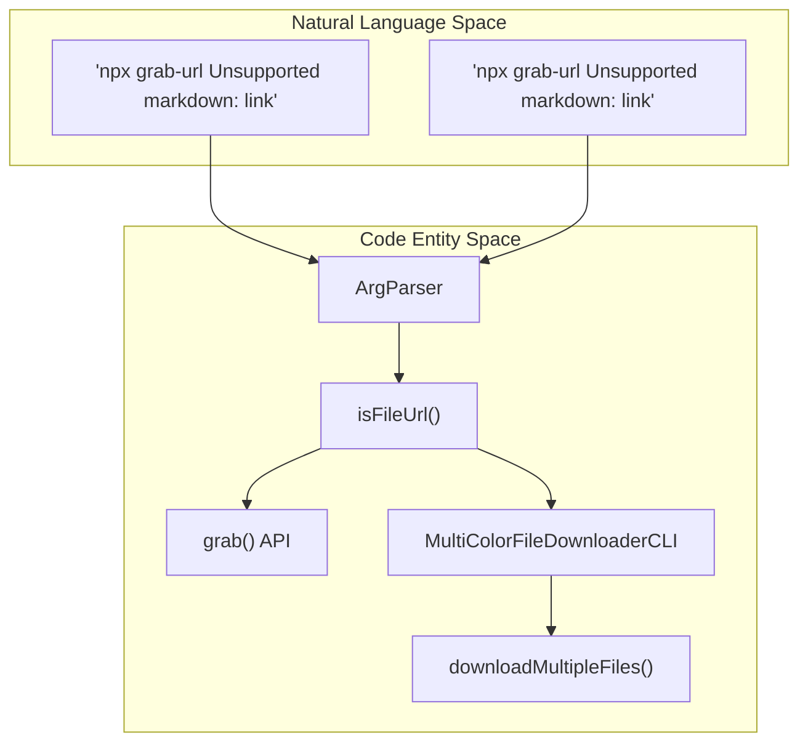
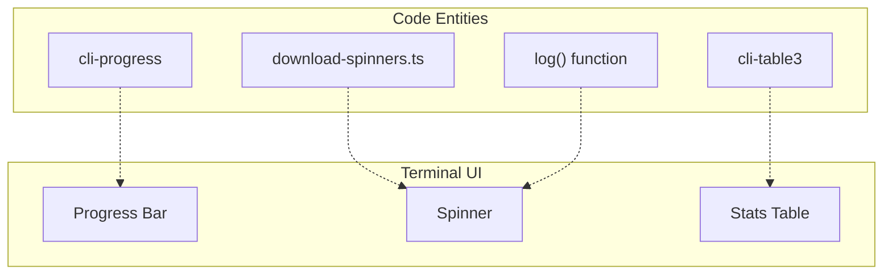

# CLI Tool (grab-url-cli)
Relevant source files
- [docs/content/docs/cli.mdx](https://github.com/vtempest/GRAB-URL/blob/a61acaf0/docs/content/docs/cli.mdx?plain=1)
- [docs/content/docs/configuration.mdx](https://github.com/vtempest/GRAB-URL/blob/a61acaf0/docs/content/docs/configuration.mdx?plain=1)
- [docs/content/docs/examples.mdx](https://github.com/vtempest/GRAB-URL/blob/a61acaf0/docs/content/docs/examples.mdx?plain=1)
- [package-lock.json](https://github.com/vtempest/GRAB-URL/blob/a61acaf0/package-lock.json)
- [package.json](https://github.com/vtempest/GRAB-URL/blob/a61acaf0/package.json)
- [packages/archiver-web/README.md](https://github.com/vtempest/GRAB-URL/blob/a61acaf0/packages/archiver-web/README.md?plain=1)
- [packages/grab-api/README.md](https://github.com/vtempest/GRAB-URL/blob/a61acaf0/packages/grab-api/README.md?plain=1)
- [packages/grab-url-cli/README.md](https://github.com/vtempest/GRAB-URL/blob/a61acaf0/packages/grab-url-cli/README.md?plain=1)
- [packages/loading-animations/README.md](https://github.com/vtempest/GRAB-URL/blob/a61acaf0/packages/loading-animations/README.md?plain=1)
- [packages/log-json/README.md](https://github.com/vtempest/GRAB-URL/blob/a61acaf0/packages/log-json/README.md?plain=1)

The `@grab-url/cli` package provides a command-line interface for the `grab-url` ecosystem. It acts as a versatile frontend that can either fetch structured data from APIs or perform high-performance file downloads with multi-color progress bars and resumable transfer logic [packages/grab-url-cli/README.md3-4](https://github.com/vtempest/GRAB-URL/blob/a61acaf0/packages/grab-url-cli/README.md?plain=1#L3-L4) It is exposed via the binaries `grab-url`, `grab`, and `g`[package.json20-24](https://github.com/vtempest/GRAB-URL/blob/a61acaf0/package.json#L20-L24)

## Overview

The CLI tool is designed to be zero-config, automatically switching its behavior based on the input provided. It leverages the core `grab()` library for API requests and a specialized `MultiColorFileDownloaderCLI` for binary transfers [packages/grab-url-cli/README.md41](https://github.com/vtempest/GRAB-URL/blob/a61acaf0/packages/grab-url-cli/README.md?plain=1#L41-L41)

### Operational Modes

The tool operates in two distinct modes, determined by the `ArgParser` and URL detection logic [packages/grab-url-cli/README.md68-69](https://github.com/vtempest/GRAB-URL/blob/a61acaf0/packages/grab-url-cli/README.md?plain=1#L68-L69):

| Mode | Trigger | Behavior |
| --- | --- | --- |
| **API Mode** | Single URL that does not look like a file. | Uses `grab()` to fetch data [packages/grab-api/README.md10-14](https://github.com/vtempest/GRAB-URL/blob/a61acaf0/packages/grab-api/README.md?plain=1#L10-L14) prints colorized output via `log()`, and saves to `output.json` by default [packages/grab-url-cli/README.md35](https://github.com/vtempest/GRAB-URL/blob/a61acaf0/packages/grab-url-cli/README.md?plain=1#L35-L35) |
| **Download Mode** | Multiple URLs or any URL with a file extension. | Uses `MultiColorFileDownloaderCLI` to manage concurrent streams with progress bars and resume support [packages/grab-url-cli/README.md85](https://github.com/vtempest/GRAB-URL/blob/a61acaf0/packages/grab-url-cli/README.md?plain=1#L85-L85) |

For details on the detection logic, see [CLI Entry Point & Argument Parsing](/vtempest/GRAB-URL/3.1-cli-entry-point-and-argument-parsing).

### Integration with Core Library

The CLI serves as a Node.js wrapper for the `@grab-url/grab-api` package. When in API mode, it invokes the `grab` function directly [packages/grab-api/README.md51](https://github.com/vtempest/GRAB-URL/blob/a61acaf0/packages/grab-api/README.md?plain=1#L51-L51) It also utilizes `@grab-url/log` for terminal output [packages/log-json/README.md5](https://github.com/vtempest/GRAB-URL/blob/a61acaf0/packages/log-json/README.md?plain=1#L5-L5) and imports Unicode/emoji frames from `@grab-url/loading-animations` for its progress bar visuals [packages/loading-animations/README.md6](https://github.com/vtempest/GRAB-URL/blob/a61acaf0/packages/loading-animations/README.md?plain=1#L6-L6)

## System Architecture

The following diagram illustrates how the CLI components bridge the gap between user commands and the underlying code entities.

### Logic Flow: CLI to Engine



Sources: [packages/grab-url-cli/README.md41-62](https://github.com/vtempest/GRAB-URL/blob/a61acaf0/packages/grab-url-cli/README.md?plain=1#L41-L62)[docs/content/docs/cli.mdx103-109](https://github.com/vtempest/GRAB-URL/blob/a61acaf0/docs/content/docs/cli.mdx?plain=1#L103-L109)

## Core Components

### Entry Point & Dispatch

The CLI entry point handles initial process execution, using a custom `ArgParser` to handle flags like `--output` (`-o`), `--params` (`-p`), and `--no-save`[packages/grab-url-cli/README.md33-39](https://github.com/vtempest/GRAB-URL/blob/a61acaf0/packages/grab-url-cli/README.md?plain=1#L33-L39) It also supports a `--x` flag for single execution without file watching [docs/content/docs/cli.mdx26-27](https://github.com/vtempest/GRAB-URL/blob/a61acaf0/docs/content/docs/cli.mdx?plain=1#L26-L27)

For details, see [CLI Entry Point & Argument Parsing](/vtempest/GRAB-URL/3.1-cli-entry-point-and-argument-parsing).

### The Download Engine

When file URLs are detected, the system instantiates `MultiColorFileDownloaderCLI`[packages/grab-url-cli/README.md57](https://github.com/vtempest/GRAB-URL/blob/a61acaf0/packages/grab-url-cli/README.md?plain=1#L57-L57) This class manages concurrent downloads and handles the lifecycle of the transfer session, including resumable state via `.download-state` sidecar files [docs/content/docs/cli.mdx112-117](https://github.com/vtempest/GRAB-URL/blob/a61acaf0/docs/content/docs/cli.mdx?plain=1#L112-L117)

For details, see [File Downloader & Transfer Engine](/vtempest/GRAB-URL/3.2-file-downloader-and-transfer-engine).

### Visual Feedback System

The CLI uses a sophisticated frame-based animation system. It pulls frame data from `loading-animations-emojis.js`[packages/loading-animations/README.md72](https://github.com/vtempest/GRAB-URL/blob/a61acaf0/packages/loading-animations/README.md?plain=1#L72-L72) and provides utilities in `download-spinners.ts` to manage progress bar formatting [packages/grab-url-cli/README.md72-73](https://github.com/vtempest/GRAB-URL/blob/a61acaf0/packages/grab-url-cli/README.md?plain=1#L72-L73)

### CLI Visual Component Mapping



Sources: [packages/grab-url-cli/README.md72-81](https://github.com/vtempest/GRAB-URL/blob/a61acaf0/packages/grab-url-cli/README.md?plain=1#L72-L81)[package.json74-76](https://github.com/vtempest/GRAB-URL/blob/a61acaf0/package.json#L74-L76)

## Programmatic Usage

While primarily a CLI, the package exports its internal primitives for use in other Node.js scripts. This allows developers to use the `MultiColorFileDownloaderCLI`, `ArgParser`, or URL utility functions like `isValidUrl` and `generateFilename` independently [packages/grab-url-cli/README.md48-62](https://github.com/vtempest/GRAB-URL/blob/a61acaf0/packages/grab-url-cli/README.md?plain=1#L48-L62)

```
import { MultiColorFileDownloaderCLI } from "@grab-url/cli";
 
const downloader = new MultiColorFileDownloaderCLI();
// Download multiple files concurrently with progress bars
await downloader.downloadMultipleFiles([
  { url: "https://example.com/file.zip", outputPath: "./file.zip", filename: "file.zip" }
]);
```

Sources: [packages/grab-url-cli/README.md48-62](https://github.com/vtempest/GRAB-URL/blob/a61acaf0/packages/grab-url-cli/README.md?plain=1#L48-L62)[docs/content/docs/cli.mdx41-67](https://github.com/vtempest/GRAB-URL/blob/a61acaf0/docs/content/docs/cli.mdx?plain=1#L41-L67)

---

## Child Pages

- [CLI Entry Point & Argument Parsing](/vtempest/GRAB-URL/3.1-cli-entry-point-and-argument-parsing) — Detailed look at `ArgParser`, URL detection logic (`isFileUrl`), and mode switching.
- [File Downloader & Transfer Engine](/vtempest/GRAB-URL/3.2-file-downloader-and-transfer-engine) — Deep dive into `MultiColorFileDownloaderCLI`, concurrent multi-file transfers, resume-state logic, and keyboard controls.