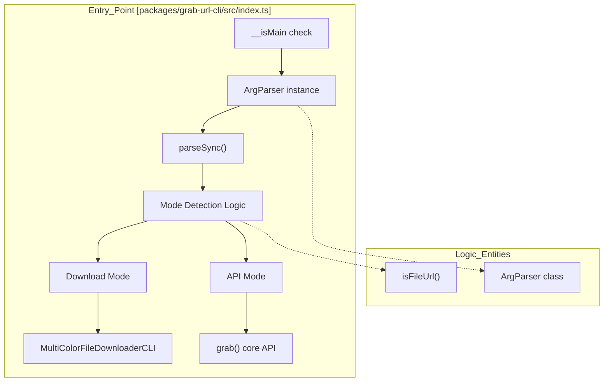
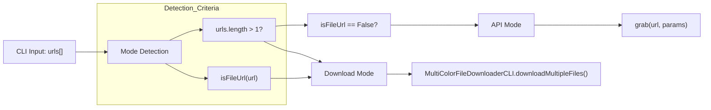

# CLI Entry Point & Argument Parsing
Relevant source files
- [dist/archiver-web.d.ts](https://github.com/vtempest/GRAB-URL/blob/a61acaf0/dist/archiver-web.d.ts)
- [dist/bin-compress.cjs.js.map](https://github.com/vtempest/GRAB-URL/blob/a61acaf0/dist/bin-compress.cjs.js.map)
- [dist/bin-compress.es.js.map](https://github.com/vtempest/GRAB-URL/blob/a61acaf0/dist/bin-compress.es.js.map)
- [dist/bin-extract.cjs.js.map](https://github.com/vtempest/GRAB-URL/blob/a61acaf0/dist/bin-extract.cjs.js.map)
- [dist/bin-extract.es.js.map](https://github.com/vtempest/GRAB-URL/blob/a61acaf0/dist/bin-extract.es.js.map)
- [dist/grab-url-cli.d.ts](https://github.com/vtempest/GRAB-URL/blob/a61acaf0/dist/grab-url-cli.d.ts)
- [packages/grab-api/src/core/content-processors.ts](https://github.com/vtempest/GRAB-URL/blob/a61acaf0/packages/grab-api/src/core/content-processors.ts)
- [packages/grab-api/src/index.slim.ts](https://github.com/vtempest/GRAB-URL/blob/a61acaf0/packages/grab-api/src/index.slim.ts)
- [packages/grab-url-cli/src/cli-args.ts](https://github.com/vtempest/GRAB-URL/blob/a61acaf0/packages/grab-url-cli/src/cli-args.ts)
- [packages/grab-url-cli/src/display/spinner-config.ts](https://github.com/vtempest/GRAB-URL/blob/a61acaf0/packages/grab-url-cli/src/display/spinner-config.ts)
- [packages/grab-url-cli/src/download-spinners.ts](https://github.com/vtempest/GRAB-URL/blob/a61acaf0/packages/grab-url-cli/src/download-spinners.ts)
- [packages/grab-url-cli/src/index.ts](https://github.com/vtempest/GRAB-URL/blob/a61acaf0/packages/grab-url-cli/src/index.ts)

The `grab-url` CLI serves as a unified interface for both API data fetching and high-performance file downloading. It utilizes a custom, lightweight argument parser to handle various input formats—ranging from simple URLs to complex JSON payloads—and automatically switches between **API Mode** and **Download Mode** based on the input provided.

## CLI Invocation & Entry Point

The CLI is defined in the `grab-url-cli` package and is intended to be executed via `npx grab-url` or its aliases (`grab`, `g`). The entry point script determines if it is being run as a main module by checking `import.meta.main` or resolving the script path against `process.argv[1]` before initializing the command-line logic [packages/grab-url-cli/src/index.ts34-45](https://github.com/vtempest/GRAB-URL/blob/a61acaf0/packages/grab-url-cli/src/index.ts#L34-L45)

### Main Execution Flow

The entry point follows a linear execution path:

1. **Define Schema**: Configures the `ArgParser` with commands, options, and examples [packages/grab-url-cli/src/index.ts48-91](https://github.com/vtempest/GRAB-URL/blob/a61acaf0/packages/grab-url-cli/src/index.ts#L48-L91)
2. **Parse Arguments**: Extracts URLs and options from `process.argv` using `parseSync()`[packages/grab-url-cli/src/index.ts91](https://github.com/vtempest/GRAB-URL/blob/a61acaf0/packages/grab-url-cli/src/index.ts#L91-L91)
3. **Detect Mode**: Evaluates if the request should use the API engine or the File Downloader [packages/grab-url-cli/src/index.ts98-100](https://github.com/vtempest/GRAB-URL/blob/a61acaf0/packages/grab-url-cli/src/index.ts#L98-L100)
4. **Execute**: Invokes either `grab()` for API calls or `MultiColorFileDownloaderCLI` for transfers [packages/grab-url-cli/src/index.ts103-172](https://github.com/vtempest/GRAB-URL/blob/a61acaf0/packages/grab-url-cli/src/index.ts#L103-L172)

### Entry Point Logic Entity Map

The following diagram maps the logical flow of the CLI entry point to the specific code entities in `index.ts`.

Title: "CLI Entry Point Execution Flow"

Sources: [packages/grab-url-cli/src/index.ts35-100](https://github.com/vtempest/GRAB-URL/blob/a61acaf0/packages/grab-url-cli/src/index.ts#L35-L100)[packages/grab-url-cli/src/cli-args.ts8-127](https://github.com/vtempest/GRAB-URL/blob/a61acaf0/packages/grab-url-cli/src/cli-args.ts#L8-L127)

---

## Argument Parsing via ArgParser

Instead of using heavy dependencies like `yargs`, the CLI uses an internal `ArgParser` class designed for zero-dependency speed and minimal bundle size [packages/grab-url-cli/src/cli-args.ts8](https://github.com/vtempest/GRAB-URL/blob/a61acaf0/packages/grab-url-cli/src/cli-args.ts#L8-L8)

### Key Capabilities

- **Positional URL Handling**: Automatically captures non-flag arguments as a list of URLs stored in the `urls` property [packages/grab-url-cli/src/cli-args.ts75](https://github.com/vtempest/GRAB-URL/blob/a61acaf0/packages/grab-url-cli/src/cli-args.ts#L75-L75)
- **Type Coercion**: Supports `boolean`, `number`, and custom `coerce` functions (used for parsing JSON strings into objects) [packages/grab-url-cli/src/cli-args.ts92-101](https://github.com/vtempest/GRAB-URL/blob/a61acaf0/packages/grab-url-cli/src/cli-args.ts#L92-L101)
- **Short Flag Aliasing**: Maps single-character flags (e.g., `-o`) to long-form options (e.g., `--output`) via `findLongName`[packages/grab-url-cli/src/cli-args.ts56-69](https://github.com/vtempest/GRAB-URL/blob/a61acaf0/packages/grab-url-cli/src/cli-args.ts#L56-L69)[packages/grab-url-cli/src/cli-args.ts103-105](https://github.com/vtempest/GRAB-URL/blob/a61acaf0/packages/grab-url-cli/src/cli-args.ts#L103-L105)

### Configured Options

The CLI defines the following primary options in the `index.ts` setup:

| Option | Alias | Type | Default | Description |
| --- | --- | --- | --- | --- |
| `--no-save` | N/A | `boolean` | `false` | Prevents writing API responses to disk; prints to stdout instead [packages/grab-url-cli/src/index.ts51-55](https://github.com/vtempest/GRAB-URL/blob/a61acaf0/packages/grab-url-cli/src/index.ts#L51-L55) |
| `--output` | `-o` | `string` | `null` | Specifies the destination filename [packages/grab-url-cli/src/index.ts56-61](https://github.com/vtempest/GRAB-URL/blob/a61acaf0/packages/grab-url-cli/src/index.ts#L56-L61) |
| `--params` | `-p` | `string` | `{}` | A JSON string of query parameters, coerced via `JSON.parse`[packages/grab-url-cli/src/index.ts62-74](https://github.com/vtempest/GRAB-URL/blob/a61acaf0/packages/grab-url-cli/src/index.ts#L62-L74) |

Sources: [packages/grab-url-cli/src/cli-args.ts8-127](https://github.com/vtempest/GRAB-URL/blob/a61acaf0/packages/grab-url-cli/src/cli-args.ts#L8-L127)[packages/grab-url-cli/src/index.ts48-91](https://github.com/vtempest/GRAB-URL/blob/a61acaf0/packages/grab-url-cli/src/index.ts#L48-L91)

---

## Mode Auto-Detection

The CLI intelligently switches between two operational modes. This detection is critical because it determines whether to use the `grab-api` request lifecycle or the `file-downloader` transfer engine.

### Detection Logic

The mode is determined by two factors:

1. **URL Count**: If more than one URL is provided (`urls.length > 1`), the CLI defaults to **Download Mode** to handle concurrent transfers [packages/grab-url-cli/src/index.ts100](https://github.com/vtempest/GRAB-URL/blob/a61acaf0/packages/grab-url-cli/src/index.ts#L100-L100)
2. **URL Pattern**: The `isFileUrl` utility uses a Regular Expression to check if the URL path (ignoring query strings) ends in a file extension (1-5 characters) [packages/grab-url-cli/src/cli-args.ts133-135](https://github.com/vtempest/GRAB-URL/blob/a61acaf0/packages/grab-url-cli/src/cli-args.ts#L133-L135)

### isFileUrl Implementation

The logic splits the URL by `?` to strip parameters and matches the base path against `/\.[a-zA-Z0-9]{1,5}(?:\.[a-zA-Z0-9]{1,5})*$/`[packages/grab-url-cli/src/cli-args.ts134](https://github.com/vtempest/GRAB-URL/blob/a61acaf0/packages/grab-url-cli/src/cli-args.ts#L134-L134)

Title: "Mode Detection & Data Flow"

Sources: [packages/grab-url-cli/src/index.ts98-100](https://github.com/vtempest/GRAB-URL/blob/a61acaf0/packages/grab-url-cli/src/index.ts#L98-L100)[packages/grab-url-cli/src/cli-args.ts133-135](https://github.com/vtempest/GRAB-URL/blob/a61acaf0/packages/grab-url-cli/src/cli-args.ts#L133-L135)

---

## API-Mode vs. Download-Mode Behavior

### API Mode Execution

When in API mode, the CLI:

1. Calls `grab(url, params)` from the core library [packages/grab-url-cli/src/index.ts172](https://github.com/vtempest/GRAB-URL/blob/a61acaf0/packages/grab-url-cli/src/index.ts#L172-L172)
2. Handles various response types: `string`, `Buffer`, `Uint8Array`, `Blob`, or `Object`[packages/grab-url-cli/src/index.ts179-197](https://github.com/vtempest/GRAB-URL/blob/a61acaf0/packages/grab-url-cli/src/index.ts#L179-L197)
3. If `--no-save` is absent, it automatically derives a filename based on the URL extension or content type (defaulting to `.json` for objects or `.bin` for binary data) [packages/grab-url-cli/src/index.ts199-208](https://github.com/vtempest/GRAB-URL/blob/a61acaf0/packages/grab-url-cli/src/index.ts#L199-L208)

### Download Mode Execution

When in Download mode, the CLI:

1. Instantiates `MultiColorFileDownloaderCLI`[packages/grab-url-cli/src/index.ts105](https://github.com/vtempest/GRAB-URL/blob/a61acaf0/packages/grab-url-cli/src/index.ts#L105-L105)
2. Maps input URLs to `Download` objects containing `outputPath` and `filename`[packages/grab-url-cli/src/index.ts107-125](https://github.com/vtempest/GRAB-URL/blob/a61acaf0/packages/grab-url-cli/src/index.ts#L107-L125)
3. Creates necessary directories using `fs.mkdirSync({ recursive: true })`[packages/grab-url-cli/src/index.ts115-116](https://github.com/vtempest/GRAB-URL/blob/a61acaf0/packages/grab-url-cli/src/index.ts#L115-L116)
4. Triggers concurrent downloads via `downloadMultipleFiles()` and displays a final summary table using `cli-table3`[packages/grab-url-cli/src/index.ts128-157](https://github.com/vtempest/GRAB-URL/blob/a61acaf0/packages/grab-url-cli/src/index.ts#L128-L157)
5. Utilizes randomized spinners and progress bar colors for visual feedback, drawing frames from the `loading-animations` package [packages/grab-url-cli/src/display/spinner-config.ts7-47](https://github.com/vtempest/GRAB-URL/blob/a61acaf0/packages/grab-url-cli/src/display/spinner-config.ts#L7-L47)[packages/grab-url-cli/src/download-spinners.ts7-35](https://github.com/vtempest/GRAB-URL/blob/a61acaf0/packages/grab-url-cli/src/download-spinners.ts#L7-L35)

Sources: [packages/grab-url-cli/src/index.ts103-214](https://github.com/vtempest/GRAB-URL/blob/a61acaf0/packages/grab-url-cli/src/index.ts#L103-L214)[packages/grab-url-cli/src/display/spinner-config.ts1-128](https://github.com/vtempest/GRAB-URL/blob/a61acaf0/packages/grab-url-cli/src/display/spinner-config.ts#L1-L128)[packages/grab-url-cli/src/download-spinners.ts1-124](https://github.com/vtempest/GRAB-URL/blob/a61acaf0/packages/grab-url-cli/src/download-spinners.ts#L1-L124)