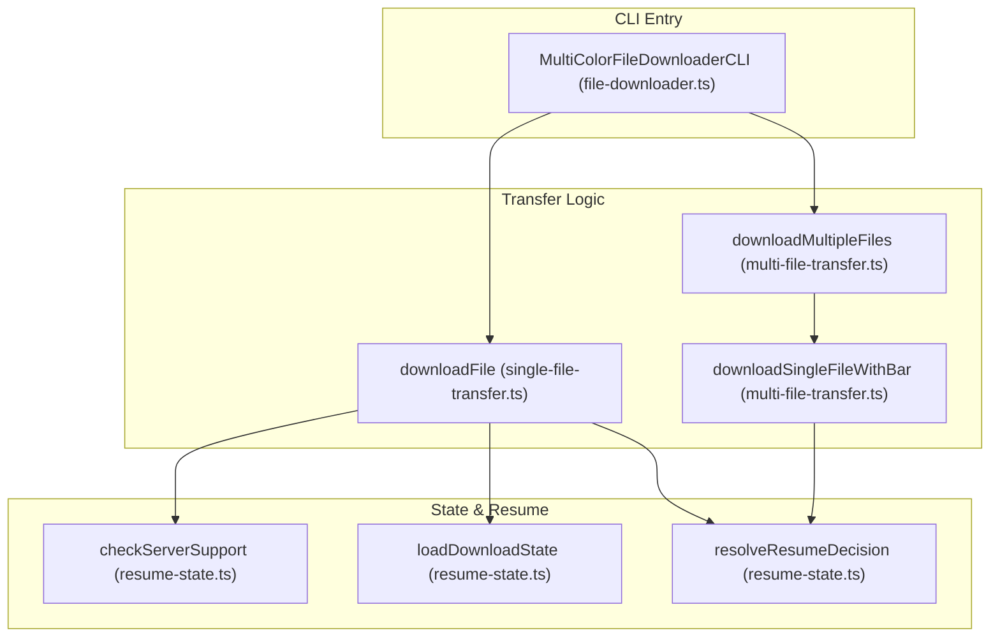
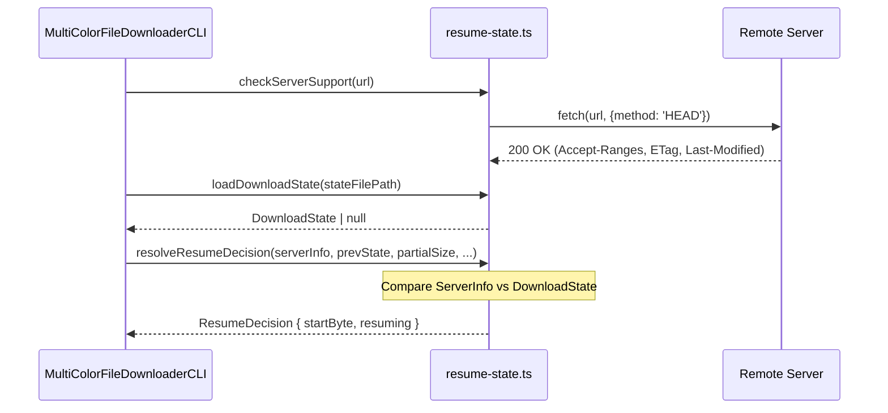

# File Downloader & Transfer Engine
Relevant source files
- [packages/grab-url-cli/src/display/progress-format.ts](https://github.com/vtempest/GRAB-URL/blob/a61acaf0/packages/grab-url-cli/src/display/progress-format.ts)
- [packages/grab-url-cli/src/file-downloader.ts](https://github.com/vtempest/GRAB-URL/blob/a61acaf0/packages/grab-url-cli/src/file-downloader.ts)
- [packages/grab-url-cli/src/keyboard-controls.ts](https://github.com/vtempest/GRAB-URL/blob/a61acaf0/packages/grab-url-cli/src/keyboard-controls.ts)
- [packages/grab-url-cli/src/transfer/multi-file-transfer.ts](https://github.com/vtempest/GRAB-URL/blob/a61acaf0/packages/grab-url-cli/src/transfer/multi-file-transfer.ts)
- [packages/grab-url-cli/src/transfer/resume-state.ts](https://github.com/vtempest/GRAB-URL/blob/a61acaf0/packages/grab-url-cli/src/transfer/resume-state.ts)
- [packages/grab-url-cli/src/transfer/single-file-transfer.ts](https://github.com/vtempest/GRAB-URL/blob/a61acaf0/packages/grab-url-cli/src/transfer/single-file-transfer.ts)
- [test/downloader.test.ts](https://github.com/vtempest/GRAB-URL/blob/a61acaf0/test/downloader.test.ts)
- [test/icon.test.ts](https://github.com/vtempest/GRAB-URL/blob/a61acaf0/test/icon.test.ts)

The **File Downloader & Transfer Engine** is the core execution layer of the `grab-url-cli` package. It provides a robust, concurrent transfer system capable of handling single or multiple file downloads with real-time visual feedback, pause/resume capabilities, and persistent state management for interrupted transfers.

## 1. MultiColorFileDownloaderCLI Class

The `MultiColorFileDownloaderCLI` class serves as the central orchestrator for the CLI's download capabilities. It delegates heavy logic to specialized modules while maintaining the UI state (spinners, bars) and lifecycle controllers.

| Property | Role |
| --- | --- |
| `progressBar` | Instance of `cliProgress.SingleBar` for individual downloads [packages/grab-url-cli/src/file-downloader.ts55](https://github.com/vtempest/GRAB-URL/blob/a61acaf0/packages/grab-url-cli/src/file-downloader.ts#L55-L55) |
| `multiBar` | Instance of `cliProgress.MultiBar` for concurrent downloads [packages/grab-url-cli/src/file-downloader.ts56](https://github.com/vtempest/GRAB-URL/blob/a61acaf0/packages/grab-url-cli/src/file-downloader.ts#L56-L56) |
| `abortControllers` | Array of `AbortController` instances to manage cancellation of active streams [packages/grab-url-cli/src/file-downloader.ts59](https://github.com/vtempest/GRAB-URL/blob/a61acaf0/packages/grab-url-cli/src/file-downloader.ts#L59-L59) |
| `isPaused` | Boolean flag synchronized across all active transfer streams [packages/grab-url-cli/src/file-downloader.ts61](https://github.com/vtempest/GRAB-URL/blob/a61acaf0/packages/grab-url-cli/src/file-downloader.ts#L61-L61) |
| `stateDir` | Path to the directory where `.download-state` files are stored [packages/grab-url-cli/src/file-downloader.ts65](https://github.com/vtempest/GRAB-URL/blob/a61acaf0/packages/grab-url-cli/src/file-downloader.ts#L65-L65) |

### Lifecycle & Control Flow

The class manages global pause/resume states through `pauseAll()` and `resumeAll()`, which trigger internal callbacks that throttle the underlying stream readers [packages/grab-url-cli/src/file-downloader.ts111-121](https://github.com/vtempest/GRAB-URL/blob/a61acaf0/packages/grab-url-cli/src/file-downloader.ts#L111-L121) It also ensures the state directory exists upon instantiation via `ensureStateDirectory`[packages/grab-url-cli/src/file-downloader.ts103](https://github.com/vtempest/GRAB-URL/blob/a61acaf0/packages/grab-url-cli/src/file-downloader.ts#L103-L103)

**Sources:**[packages/grab-url-cli/src/file-downloader.ts54-129](https://github.com/vtempest/GRAB-URL/blob/a61acaf0/packages/grab-url-cli/src/file-downloader.ts#L54-L129)[packages/grab-url-cli/src/transfer/resume-state.ts49-57](https://github.com/vtempest/GRAB-URL/blob/a61acaf0/packages/grab-url-cli/src/transfer/resume-state.ts#L49-L57)

## 2. Transfer Modules

The engine splits transfer logic into two primary modules to optimize for different CLI display modes.

### Single-File Transfer

The `downloadFile` function manages a standalone download using a custom `SingleDownloadContext`[packages/grab-url-cli/src/transfer/single-file-transfer.ts46-57](https://github.com/vtempest/GRAB-URL/blob/a61acaf0/packages/grab-url-cli/src/transfer/single-file-transfer.ts#L46-L57) It initializes a `cliProgress.SingleBar` for the data transfer [packages/grab-url-cli/src/transfer/single-file-transfer.ts164-187](https://github.com/vtempest/GRAB-URL/blob/a61acaf0/packages/grab-url-cli/src/transfer/single-file-transfer.ts#L164-L187) The transfer implements a `processChunk` loop that checks the `isPaused` state before reading from the response body reader, effectively throttling the stream [packages/grab-url-cli/src/transfer/single-file-transfer.ts209-212](https://github.com/vtempest/GRAB-URL/blob/a61acaf0/packages/grab-url-cli/src/transfer/single-file-transfer.ts#L209-L212)

### Multi-File Transfer

The `downloadMultipleFiles` function orchestrates concurrent downloads. It initializes a `MultiBar` container and creates a "Master Bar" to track aggregate progress across all files [packages/grab-url-cli/src/transfer/multi-file-transfer.ts100-147](https://github.com/vtempest/GRAB-URL/blob/a61acaf0/packages/grab-url-cli/src/transfer/multi-file-transfer.ts#L100-L147) It uses a `setInterval` to calculate and update individual and aggregate download speeds [packages/grab-url-cli/src/transfer/multi-file-transfer.ts164-180](https://github.com/vtempest/GRAB-URL/blob/a61acaf0/packages/grab-url-cli/src/transfer/multi-file-transfer.ts#L164-L180)

### Transfer Engine Entity Map

This diagram maps the high-level transfer concepts to the specific code entities that implement them.

**Sources:**[packages/grab-url-cli/src/file-downloader.ts149-179](https://github.com/vtempest/GRAB-URL/blob/a61acaf0/packages/grab-url-cli/src/file-downloader.ts#L149-L179)[packages/grab-url-cli/src/transfer/single-file-transfer.ts69-100](https://github.com/vtempest/GRAB-URL/blob/a61acaf0/packages/grab-url-cli/src/transfer/single-file-transfer.ts#L69-L100)[packages/grab-url-cli/src/transfer/multi-file-transfer.ts100-181](https://github.com/vtempest/GRAB-URL/blob/a61acaf0/packages/grab-url-cli/src/transfer/multi-file-transfer.ts#L100-L181)

## 3. Resume-State Logic

The engine uses a sidecar file strategy to persist download progress. For every file `example.zip`, a metadata file `example.zip.download-state` is created in the `.grab-downloads` directory [packages/grab-url-cli/src/transfer/resume-state.ts62-64](https://github.com/vtempest/GRAB-URL/blob/a61acaf0/packages/grab-url-cli/src/transfer/resume-state.ts#L62-L64)

### Resume Validation Flow

Before starting a transfer, the engine performs a "Resume Decision" check:

1. **Server Probing**: Issues a `HEAD` request via `checkServerSupport` to check `accept-ranges: bytes` and retrieve `etag` or `last-modified` headers [packages/grab-url-cli/src/transfer/resume-state.ts105-118](https://github.com/vtempest/GRAB-URL/blob/a61acaf0/packages/grab-url-cli/src/transfer/resume-state.ts#L105-L118)
2. **Local Comparison**: Compares the remote headers against the saved `DownloadState`[packages/grab-url-cli/src/transfer/resume-state.ts132-143](https://github.com/vtempest/GRAB-URL/blob/a61acaf0/packages/grab-url-cli/src/transfer/resume-state.ts#L132-L143)
3. **Decision**:

- If the file is unchanged and the server supports ranges, it calculates the `startByte` from the existing `.tmp` file size [packages/grab-url-cli/src/transfer/resume-state.ts145-146](https://github.com/vtempest/GRAB-URL/blob/a61acaf0/packages/grab-url-cli/src/transfer/resume-state.ts#L145-L146)
- If the file has changed or ranges are unsupported, it deletes the partial file via `fs.unlinkSync` and starts from byte 0 [packages/grab-url-cli/src/transfer/resume-state.ts149-155](https://github.com/vtempest/GRAB-URL/blob/a61acaf0/packages/grab-url-cli/src/transfer/resume-state.ts#L149-L155)

### Resume Logic Sequence

**Sources:**[packages/grab-url-cli/src/transfer/resume-state.ts13-156](https://github.com/vtempest/GRAB-URL/blob/a61acaf0/packages/grab-url-cli/src/transfer/resume-state.ts#L13-L156)

## 4. Keyboard Controls & Interactive Mode

The engine attaches a raw-mode stdin listener via `setupKeyboardListener` to handle real-time user interaction without interrupting the transfer streams [packages/grab-url-cli/src/keyboard-controls.ts32-35](https://github.com/vtempest/GRAB-URL/blob/a61acaf0/packages/grab-url-cli/src/keyboard-controls.ts#L32-L35)

| Key | Action | Implementation |
| --- | --- | --- |
| `p` | Toggle Pause/Resume | Calls `callbacks.isPaused()` to check state and then `pauseAll()` or `resumeAll()`[packages/grab-url-cli/src/keyboard-controls.ts44-47](https://github.com/vtempest/GRAB-URL/blob/a61acaf0/packages/grab-url-cli/src/keyboard-controls.ts#L44-L47) |
| `a` | Add URL | Triggers `promptForNewUrl()` to inject a new transfer into the session [packages/grab-url-cli/src/keyboard-controls.ts48-50](https://github.com/vtempest/GRAB-URL/blob/a61acaf0/packages/grab-url-cli/src/keyboard-controls.ts#L48-L50) |
| `Ctrl+C` | Cancel | Logs cancellation and executes `process.exit(0)`[packages/grab-url-cli/src/keyboard-controls.ts40-43](https://github.com/vtempest/GRAB-URL/blob/a61acaf0/packages/grab-url-cli/src/keyboard-controls.ts#L40-L43) |

### Dynamic URL Injection

When a user presses `a`, the engine uses `readline.createInterface` to capture a new URL. If a `multiBar` is active, it calls `addToMultipleDownloads` to dynamically append a new progress bar and stream to the existing CLI view [packages/grab-url-cli/src/keyboard-controls.ts70-98](https://github.com/vtempest/GRAB-URL/blob/a61acaf0/packages/grab-url-cli/src/keyboard-controls.ts#L70-L98)

**Sources:**[packages/grab-url-cli/src/keyboard-controls.ts32-112](https://github.com/vtempest/GRAB-URL/blob/a61acaf0/packages/grab-url-cli/src/keyboard-controls.ts#L32-L112)

## 5. Formatting & Display

The `progress-format.ts` utility provides stateless functions for consistent CLI output. It uses a fixed-width column system to prevent UI flickering during high-speed transfers.

- **Column Widths**: Defined for `COL_FILENAME` (25), `COL_BAR` (15), `COL_SPEED` (10), and `COL_ETA` (10) [packages/grab-url-cli/src/display/progress-format.ts11-18](https://github.com/vtempest/GRAB-URL/blob/a61acaf0/packages/grab-url-cli/src/display/progress-format.ts#L11-L18)
- **Byte Formatting**: `formatBytes` provides colorized human-readable strings (KB, MB, GB) based on the size magnitude [packages/grab-url-cli/src/display/progress-format.ts39-55](https://github.com/vtempest/GRAB-URL/blob/a61acaf0/packages/grab-url-cli/src/display/progress-format.ts#L39-L55)
- **Filename Truncation**: `truncateFilename` preserves file extensions while shortening long names using an ellipsis based on `maxLength`[packages/grab-url-cli/src/display/progress-format.ts84-93](https://github.com/vtempest/GRAB-URL/blob/a61acaf0/packages/grab-url-cli/src/display/progress-format.ts#L84-L93)
- **ETA Formatting**: `formatETA` converts seconds into `H:MM:SS` format [packages/grab-url-cli/src/display/progress-format.ts98-104](https://github.com/vtempest/GRAB-URL/blob/a61acaf0/packages/grab-url-cli/src/display/progress-format.ts#L98-L104)

**Sources:**[packages/grab-url-cli/src/display/progress-format.ts1-168](https://github.com/vtempest/GRAB-URL/blob/a61acaf0/packages/grab-url-cli/src/display/progress-format.ts#L1-L168)