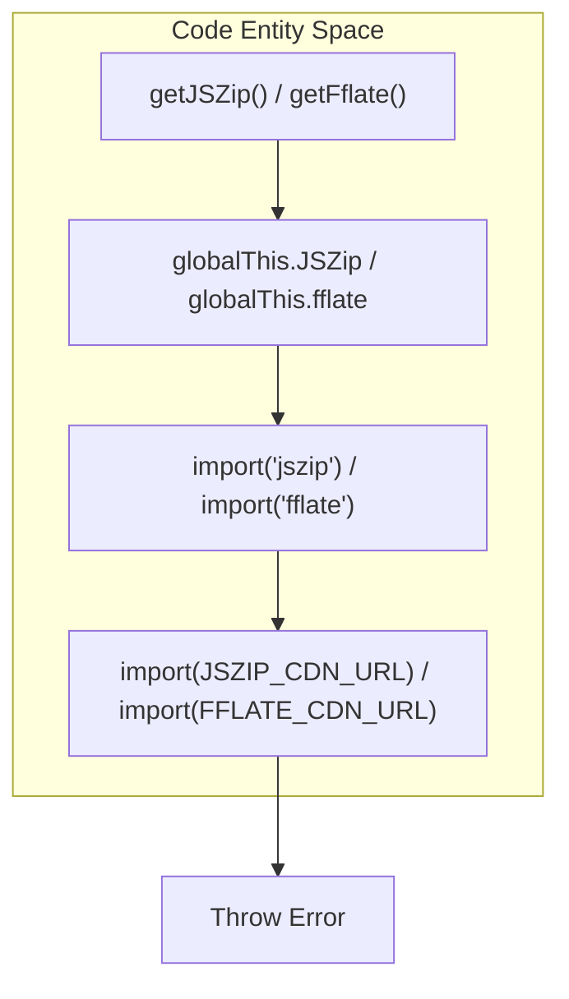
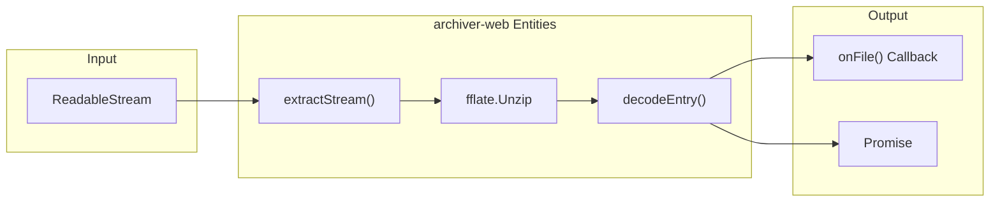

# archiver-web: ZIP Extraction & Compression
Relevant source files
- [.github/workflows/npm-publish.yml](https://github.com/vtempest/GRAB-URL/blob/a61acaf0/.github/workflows/npm-publish.yml)
- [dist/animations.es.js.map](https://github.com/vtempest/GRAB-URL/blob/a61acaf0/dist/animations.es.js.map)
- [dist/archiver-web/src/bin-compress.d.ts](https://github.com/vtempest/GRAB-URL/blob/a61acaf0/dist/archiver-web/src/bin-compress.d.ts)
- [dist/archiver-web/src/bin-extract.d.ts](https://github.com/vtempest/GRAB-URL/blob/a61acaf0/dist/archiver-web/src/bin-extract.d.ts)
- [dist/archiver-web/src/index.d.ts](https://github.com/vtempest/GRAB-URL/blob/a61acaf0/dist/archiver-web/src/index.d.ts)
- [dist/archiver-web/src/types.d.ts](https://github.com/vtempest/GRAB-URL/blob/a61acaf0/dist/archiver-web/src/types.d.ts)
- [packages/archiver-web/package.json](https://github.com/vtempest/GRAB-URL/blob/a61acaf0/packages/archiver-web/package.json)
- [packages/archiver-web/src/index.ts](https://github.com/vtempest/GRAB-URL/blob/a61acaf0/packages/archiver-web/src/index.ts)
- [packages/loading-animations/package.json](https://github.com/vtempest/GRAB-URL/blob/a61acaf0/packages/loading-animations/package.json)
- [packages/quantum-sphere-loading-animation/package.json](https://github.com/vtempest/GRAB-URL/blob/a61acaf0/packages/quantum-sphere-loading-animation/package.json)
- [packages/quantum-sphere-loading-animation/tsup.config.ts](https://github.com/vtempest/GRAB-URL/blob/a61acaf0/packages/quantum-sphere-loading-animation/tsup.config.ts)

The `archiver-web` package provides a universal, pure-JavaScript solution for ZIP archive manipulation. It is designed to work seamlessly in both browser and Node.js environments without requiring WASM or Web Workers [packages/archiver-web/src/index.ts1-4](https://github.com/vtempest/GRAB-URL/blob/a61acaf0/packages/archiver-web/src/index.ts#L1-L4) It serves as the underlying engine for the `grab()` API's automatic unzipping feature and provides CLI tools for standalone use [packages/archiver-web/package.json4-10](https://github.com/vtempest/GRAB-URL/blob/a61acaf0/packages/archiver-web/package.json#L4-L10)

## Package Overview

`archiver-web` is built as a lightweight wrapper around `JSZip` and `fflate`. It utilizes a lazy-loading strategy to keep the initial bundle size small, fetching heavy dependencies from a CDN only when they are not available locally or in the global scope [packages/archiver-web/src/index.ts25-30](https://github.com/vtempest/GRAB-URL/blob/a61acaf0/packages/archiver-web/src/index.ts#L25-L30)

### Key Functions

- `extract()`: Extracts files from an `ArrayBuffer` using `JSZip`[packages/archiver-web/src/index.ts206-212](https://github.com/vtempest/GRAB-URL/blob/a61acaf0/packages/archiver-web/src/index.ts#L206-L212)
- `extractStream()`: Performs streaming extraction from a `ReadableStream` using `fflate`, allowing processing of files before the full archive is downloaded [packages/archiver-web/src/index.ts112-116](https://github.com/vtempest/GRAB-URL/blob/a61acaf0/packages/archiver-web/src/index.ts#L112-L116)
- `compress()`: Creates ZIP archives from file lists using `JSZip`[packages/archiver-web/src/index.ts236-242](https://github.com/vtempest/GRAB-URL/blob/a61acaf0/packages/archiver-web/src/index.ts#L236-L242)
- `decodeEntry()`: Internal utility that decodes entry bytes as UTF-8 text, falling back to base64 for binary data [packages/archiver-web/src/index.ts89-100](https://github.com/vtempest/GRAB-URL/blob/a61acaf0/packages/archiver-web/src/index.ts#L89-L100)

**Sources:**[packages/archiver-web/package.json1-4](https://github.com/vtempest/GRAB-URL/blob/a61acaf0/packages/archiver-web/package.json#L1-L4)[packages/archiver-web/src/index.ts1-23](https://github.com/vtempest/GRAB-URL/blob/a61acaf0/packages/archiver-web/src/index.ts#L1-L23)

---

## Lazy-Loading & Dependency Management

To maintain a "no-dependency" feel for the core library, `archiver-web` treats `jszip` and `fflate` as optional dependencies [packages/archiver-web/package.json20-23](https://github.com/vtempest/GRAB-URL/blob/a61acaf0/packages/archiver-web/package.json#L20-L23)

### Resolution Logic

When a compression or extraction function is called, the library attempts to resolve the required dependency in the following order:

1. **Global Scope**: Checks `globalThis` for `JSZip` or `fflate` (e.g., if loaded via a `<script>` tag) [packages/archiver-web/src/index.ts34-35](https://github.com/vtempest/GRAB-URL/blob/a61acaf0/packages/archiver-web/src/index.ts#L34-L35)[packages/archiver-web/src/index.ts68-69](https://github.com/vtempest/GRAB-URL/blob/a61acaf0/packages/archiver-web/src/index.ts#L68-L69)
2. **Local Module**: Attempts a dynamic `import()` of the package, allowing bundlers like Vite to include them if installed [packages/archiver-web/src/index.ts38-40](https://github.com/vtempest/GRAB-URL/blob/a61acaf0/packages/archiver-web/src/index.ts#L38-L40)[packages/archiver-web/src/index.ts72-73](https://github.com/vtempest/GRAB-URL/blob/a61acaf0/packages/archiver-web/src/index.ts#L72-L73)
3. **CDN Fallback**: Imports from `esm.sh` (e.g., `https://esm.sh/jszip@3.10.1`) using `@vite-ignore` to prevent bundler interference during build time [packages/archiver-web/src/index.ts17-19](https://github.com/vtempest/GRAB-URL/blob/a61acaf0/packages/archiver-web/src/index.ts#L17-L19)[packages/archiver-web/src/index.ts46-48](https://github.com/vtempest/GRAB-URL/blob/a61acaf0/packages/archiver-web/src/index.ts#L46-L48)[packages/archiver-web/src/index.ts79-81](https://github.com/vtempest/GRAB-URL/blob/a61acaf0/packages/archiver-web/src/index.ts#L79-L81)

### Dependency Resolution Flow

This diagram illustrates how `getJSZip` and `getFflate` resolve their underlying libraries.

"Dependency Resolution Logic"

**Sources:**[packages/archiver-web/src/index.ts28-87](https://github.com/vtempest/GRAB-URL/blob/a61acaf0/packages/archiver-web/src/index.ts#L28-L87)

---

## Extraction Implementation

### ArrayBuffer Extraction (`extract`)

The `extract` function is the primary method for processing completed downloads. It takes an `archiveBuffer` and returns an array of `ExtractEvent` objects containing the file path, size, and content [packages/archiver-web/src/index.ts206-215](https://github.com/vtempest/GRAB-URL/blob/a61acaf0/packages/archiver-web/src/index.ts#L206-L215) It iterates through `JSZip` objects and calls `file.async("uint8array")` to retrieve data [packages/archiver-web/src/index.ts223-228](https://github.com/vtempest/GRAB-URL/blob/a61acaf0/packages/archiver-web/src/index.ts#L223-L228)

### Streaming Extraction (`extractStream`)

For large archives, `extractStream` uses `fflate` to parse the ZIP structure as bytes arrive via a `ReadableStream`[packages/archiver-web/src/index.ts112-116](https://github.com/vtempest/GRAB-URL/blob/a61acaf0/packages/archiver-web/src/index.ts#L112-L116) It registers `UnzipInflate` to handle compressed entries and uses `unzip.onfile` to handle entry detection [packages/archiver-web/src/index.ts128-136](https://github.com/vtempest/GRAB-URL/blob/a61acaf0/packages/archiver-web/src/index.ts#L128-L136)

"Streaming Extraction Data Flow"

**Sources:**[packages/archiver-web/src/index.ts112-196](https://github.com/vtempest/GRAB-URL/blob/a61acaf0/packages/archiver-web/src/index.ts#L112-L196)[dist/archiver-web/src/types.d.ts4-13](https://github.com/vtempest/GRAB-URL/blob/a61acaf0/dist/archiver-web/src/types.d.ts#L4-L13)

---

## Compression Implementation

The `compress` function facilitates creating ZIP files. It accepts a `CreateOptions` object containing a list of files, which can be `string`, `Uint8Array`, `ArrayBuffer`, or `Blob`[packages/archiver-web/src/index.ts236-242](https://github.com/vtempest/GRAB-URL/blob/a61acaf0/packages/archiver-web/src/index.ts#L236-L242)

### Process:

1. Resolves `JSZip` via `getJSZip()`[packages/archiver-web/src/index.ts243](https://github.com/vtempest/GRAB-URL/blob/a61acaf0/packages/archiver-web/src/index.ts#L243-L243)
2. Iterates through the `files` array and calls `zip.file(file.path, file.content)`[packages/archiver-web/src/index.ts246-248](https://github.com/vtempest/GRAB-URL/blob/a61acaf0/packages/archiver-web/src/index.ts#L246-L248)
3. Generates a ZIP blob using `zip.generateAsync` with the specified `compressionLevel` (defaults to 6) [packages/archiver-web/src/index.ts251-255](https://github.com/vtempest/GRAB-URL/blob/a61acaf0/packages/archiver-web/src/index.ts#L251-L255)
4. Returns an `ArchiveFile` containing the resulting `Blob` and metadata like `mime` and `downloadName`[packages/archiver-web/src/index.ts257-261](https://github.com/vtempest/GRAB-URL/blob/a61acaf0/packages/archiver-web/src/index.ts#L257-L261)

**Sources:**[packages/archiver-web/src/index.ts236-263](https://github.com/vtempest/GRAB-URL/blob/a61acaf0/packages/archiver-web/src/index.ts#L236-L263)[dist/archiver-web/src/types.d.ts17-38](https://github.com/vtempest/GRAB-URL/blob/a61acaf0/dist/archiver-web/src/types.d.ts#L17-L38)

---

## CLI Utilities

The package includes two CLI binaries for terminal-based ZIP operations, which are mapped in `package.json`[packages/archiver-web/package.json7-10](https://github.com/vtempest/GRAB-URL/blob/a61acaf0/packages/archiver-web/package.json#L7-L10)

| Binary | Source File | Description |
| --- | --- | --- |
| `extract` | `./dist/bin-extract.js` | Extracts an archive file to a directory or stdout [packages/archiver-web/package.json8](https://github.com/vtempest/GRAB-URL/blob/a61acaf0/packages/archiver-web/package.json#L8-L8) |
| `compress` | `./dist/bin-compress.js` | Compresses files/stdin into a ZIP archive [packages/archiver-web/package.json9](https://github.com/vtempest/GRAB-URL/blob/a61acaf0/packages/archiver-web/package.json#L9-L9) |

### CLI Implementation Detail

The CLI tools are registered as executable binaries in the package manifest [packages/archiver-web/package.json7-10](https://github.com/vtempest/GRAB-URL/blob/a61acaf0/packages/archiver-web/package.json#L7-L10) These tools provide a bridge between the terminal environment and the core `extract()` and `compress()` logic. The extraction binary and compression binary leverage the same underlying `archiver-web` library used by the `grab()` API, but are compiled to separate entry points [dist/archiver-web/src/bin-extract.d.ts1](https://github.com/vtempest/GRAB-URL/blob/a61acaf0/dist/archiver-web/src/bin-extract.d.ts#L1-L1)[dist/archiver-web/src/bin-compress.d.ts1](https://github.com/vtempest/GRAB-URL/blob/a61acaf0/dist/archiver-web/src/bin-compress.d.ts#L1-L1)

**Sources:**[packages/archiver-web/package.json7-10](https://github.com/vtempest/GRAB-URL/blob/a61acaf0/packages/archiver-web/package.json#L7-L10)[dist/archiver-web/src/bin-extract.d.ts1](https://github.com/vtempest/GRAB-URL/blob/a61acaf0/dist/archiver-web/src/bin-extract.d.ts#L1-L1)[dist/archiver-web/src/bin-compress.d.ts1](https://github.com/vtempest/GRAB-URL/blob/a61acaf0/dist/archiver-web/src/bin-compress.d.ts#L1-L1)