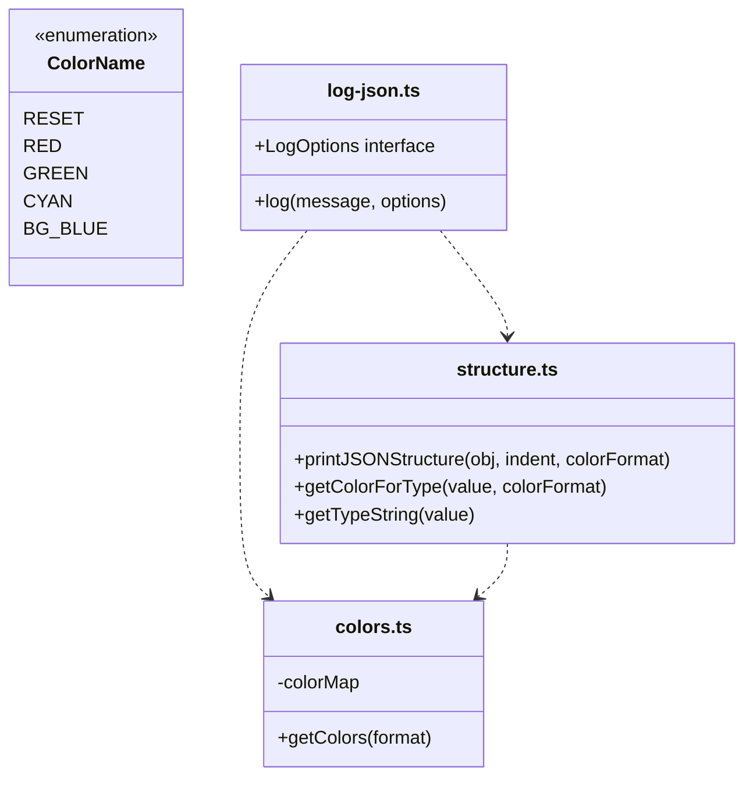

# log-json: Colorized Structured Logging
Relevant source files
- [dist/log.cjs.js](https://github.com/vtempest/GRAB-URL/blob/a61acaf0/dist/log.cjs.js)
- [dist/log.cjs.js.map](https://github.com/vtempest/GRAB-URL/blob/a61acaf0/dist/log.cjs.js.map)
- [dist/log.d.ts](https://github.com/vtempest/GRAB-URL/blob/a61acaf0/dist/log.d.ts)
- [dist/log.es.js](https://github.com/vtempest/GRAB-URL/blob/a61acaf0/dist/log.es.js)
- [dist/log.es.js.map](https://github.com/vtempest/GRAB-URL/blob/a61acaf0/dist/log.es.js.map)
- [packages/log-json/src/colors.ts](https://github.com/vtempest/GRAB-URL/blob/a61acaf0/packages/log-json/src/colors.ts)
- [packages/log-json/src/log-json.ts](https://github.com/vtempest/GRAB-URL/blob/a61acaf0/packages/log-json/src/log-json.ts)
- [packages/log-json/src/structure.ts](https://github.com/vtempest/GRAB-URL/blob/a61acaf0/packages/log-json/src/structure.ts)
- [test/log.test.ts](https://github.com/vtempest/GRAB-URL/blob/a61acaf0/test/log.test.ts)

The `log-json` package provides a specialized logging utility designed for the GRAB-URL ecosystem. It handles colorized terminal output, browser console styling, and a unique structural visualization for JSON objects. It is used extensively by the `grab()` core for debug output and by the CLI for status updates and spinner animations.

## Core Logging Engine

The primary entry point is the `log()` function [packages/log-json/src/log-json.ts15-80](https://github.com/vtempest/GRAB-URL/blob/a61acaf0/packages/log-json/src/log-json.ts#L15-L80) This function is isomorphic, adapting its behavior based on whether it is running in a Node.js terminal or a web browser.

### Key Capabilities

- **Isomorphic Styling**: Uses ANSI escape codes in terminal environments and CSS `%c` styling in browsers [packages/log-json/src/log-json.ts39-46](https://github.com/vtempest/GRAB-URL/blob/a61acaf0/packages/log-json/src/log-json.ts#L39-L46)
- **Production Safety**: Automatically suppresses logs based on hostname (defaults to hiding if not `localhost`) [packages/log-json/src/log-json.ts25-30](https://github.com/vtempest/GRAB-URL/blob/a61acaf0/packages/log-json/src/log-json.ts#L25-L30)
- **Object Visualization**: When an object is passed, it automatically prepends a type-outline generated by `printJSONStructure()` before the stringified data [packages/log-json/src/log-json.ts32-34](https://github.com/vtempest/GRAB-URL/blob/a61acaf0/packages/log-json/src/log-json.ts#L32-L34)
- **Terminal Spinners**: Built-in support for simple CLI progress animations using a 10-frame character set [packages/log-json/src/log-json.ts51-66](https://github.com/vtempest/GRAB-URL/blob/a61acaf0/packages/log-json/src/log-json.ts#L51-L66)

### The log() Logic Flow

The following diagram illustrates how the `log()` function processes inputs and determines output format.

**Title: log() Execution Flow**

```

```

**Sources:**[packages/log-json/src/log-json.ts15-80](https://github.com/vtempest/GRAB-URL/blob/a61acaf0/packages/log-json/src/log-json.ts#L15-L80)[packages/log-json/src/colors.ts88-100](https://github.com/vtempest/GRAB-URL/blob/a61acaf0/packages/log-json/src/colors.ts#L88-L100)

---

## Type-Outline Visualization

The `printJSONStructure()` function [packages/log-json/src/structure.ts45-121](https://github.com/vtempest/GRAB-URL/blob/a61acaf0/packages/log-json/src/structure.ts#L45-L121) creates a hierarchical "blueprint" of a JSON object. Instead of showing values, it shows the keys and their corresponding types, color-coded for readability.

### Type Mapping

The system maps JavaScript types to specific colors and string representations via `getColorForType`[packages/log-json/src/structure.ts12-22](https://github.com/vtempest/GRAB-URL/blob/a61acaf0/packages/log-json/src/structure.ts#L12-L22) and `getTypeString`[packages/log-json/src/structure.ts27-39](https://github.com/vtempest/GRAB-URL/blob/a61acaf0/packages/log-json/src/structure.ts#L27-L39):

| Data Type | String Representation | Default Color |
| --- | --- | --- |
| `string` | `""` | Yellow |
| `number` | `number` | Cyan |
| `boolean` | `bool` | Magenta |
| `function` | `function` | Red |
| `null` | `null` | Gray |
| `Array` | `[type]` | Blue |
| `Object` | `{...}` | Green |

**Sources:**[packages/log-json/src/structure.ts12-39](https://github.com/vtempest/GRAB-URL/blob/a61acaf0/packages/log-json/src/structure.ts#L12-L39)

### HTML vs. ANSI Output

- **ANSI (Terminal)**: Uses indentation and line breaks to show hierarchy [packages/log-json/src/structure.ts105-120](https://github.com/vtempest/GRAB-URL/blob/a61acaf0/packages/log-json/src/structure.ts#L105-L120)
- **HTML (Browser)**: Generates interactive `<details>` and `<summary>` tags, allowing users to collapse/expand nested object structures in the console [packages/log-json/src/structure.ts90-103](https://github.com/vtempest/GRAB-URL/blob/a61acaf0/packages/log-json/src/structure.ts#L90-L103) For arrays, it provides a summary showing length and element type (e.g., `[ 10 × number ]`) [packages/log-json/src/structure.ts67](https://github.com/vtempest/GRAB-URL/blob/a61acaf0/packages/log-json/src/structure.ts#L67-L67)

---

## Color System

The color system is governed by the `ColorName` enum [packages/log-json/src/colors.ts4-38](https://github.com/vtempest/GRAB-URL/blob/a61acaf0/packages/log-json/src/colors.ts#L4-L38) and a centralized `colorMap` that provides both ANSI codes for terminals and Hex codes for HTML [packages/log-json/src/colors.ts43-77](https://github.com/vtempest/GRAB-URL/blob/a61acaf0/packages/log-json/src/colors.ts#L43-L77)

### Color Retrieval

The `getColors(format)` function returns a record of color strings [packages/log-json/src/colors.ts88-100](https://github.com/vtempest/GRAB-URL/blob/a61acaf0/packages/log-json/src/colors.ts#L88-L100) In HTML mode, it returns `<span>` tags with inline styles, while in ANSI mode it returns standard escape sequences [packages/log-json/src/colors.ts91-97](https://github.com/vtempest/GRAB-URL/blob/a61acaf0/packages/log-json/src/colors.ts#L91-L97)

**Title: log-json Entity Mapping**



**Sources:**[packages/log-json/src/colors.ts4-38](https://github.com/vtempest/GRAB-URL/blob/a61acaf0/packages/log-json/src/colors.ts#L4-L38)[packages/log-json/src/log-json.ts7-10](https://github.com/vtempest/GRAB-URL/blob/a61acaf0/packages/log-json/src/log-json.ts#L7-L10)[packages/log-json/src/structure.ts7-12](https://github.com/vtempest/GRAB-URL/blob/a61acaf0/packages/log-json/src/structure.ts#L7-L12)

---

## Integration with CLI and grab()

`log-json` serves as the visual backbone for other packages in the monorepo:

1. **Terminal Spinners**: The `log()` function manages a global interval (`(globalThis as any).interval`) to animate a 10-frame spinner (`⠋⠙⠹⠸⠼⠴⠦⠧⠇⠏`) [packages/log-json/src/log-json.ts51-61](https://github.com/vtempest/GRAB-URL/blob/a61acaf0/packages/log-json/src/log-json.ts#L51-L61) It uses `\r` to overwrite the current line in the terminal [packages/log-json/src/log-json.ts55](https://github.com/vtempest/GRAB-URL/blob/a61acaf0/packages/log-json/src/log-json.ts#L55-L55)
2. **Debug Output**: When `grab()` is called with debug enabled, it uses `log-json` to print the request and response structures, making it easy for developers to verify API shapes at a glance.
3. **CLI Feedback**: The `grab-url-cli` uses the `startSpinner` and `stopSpinner` options to provide real-time feedback during network-intensive operations [packages/log-json/src/log-json.ts89-93](https://github.com/vtempest/GRAB-URL/blob/a61acaf0/packages/log-json/src/log-json.ts#L89-L93)

### LogOptions Interface

The behavior of `log()` is customized via the `LogOptions` object [packages/log-json/src/log-json.ts82-93](https://github.com/vtempest/GRAB-URL/blob/a61acaf0/packages/log-json/src/log-json.ts#L82-L93):

- `style`: CSS string or array for browser console styling [packages/log-json/src/log-json.ts84](https://github.com/vtempest/GRAB-URL/blob/a61acaf0/packages/log-json/src/log-json.ts#L84-L84)
- `color`: `ColorName`, array of names, or raw string for terminal environments [packages/log-json/src/log-json.ts86](https://github.com/vtempest/GRAB-URL/blob/a61acaf0/packages/log-json/src/log-json.ts#L86-L86)
- `hideInProduction`: Boolean toggle for environment-specific logging; auto-detects `localhost` based on `window.location.hostname` if undefined [packages/log-json/src/log-json.ts26-88](https://github.com/vtempest/GRAB-URL/blob/a61acaf0/packages/log-json/src/log-json.ts#L26-L88)
- `startSpinner`/`stopSpinner`: CLI animation controls that trigger `setInterval` or `clearInterval` on the global scope [packages/log-json/src/log-json.ts51-92](https://github.com/vtempest/GRAB-URL/blob/a61acaf0/packages/log-json/src/log-json.ts#L51-L92)

**Sources:**[packages/log-json/src/log-json.ts82-93](https://github.com/vtempest/GRAB-URL/blob/a61acaf0/packages/log-json/src/log-json.ts#L82-L93)[packages/log-json/src/log-json.ts51-66](https://github.com/vtempest/GRAB-URL/blob/a61acaf0/packages/log-json/src/log-json.ts#L51-L66)[test/log.test.ts49-57](https://github.com/vtempest/GRAB-URL/blob/a61acaf0/test/log.test.ts#L49-L57)