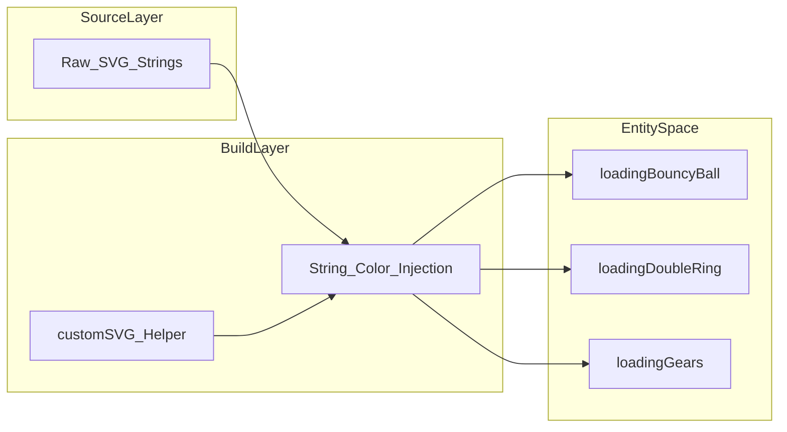
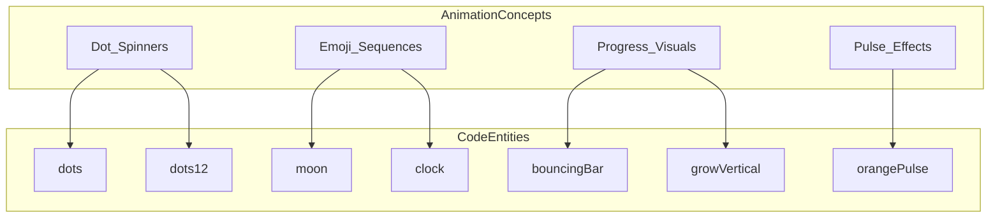

# loading-animations: SVG & CLI Spinners
Relevant source files
- [.github/workflows/npm-publish.yml](https://github.com/vtempest/GRAB-URL/blob/a61acaf0/.github/workflows/npm-publish.yml)
- [dist/animations.cjs.js](https://github.com/vtempest/GRAB-URL/blob/a61acaf0/dist/animations.cjs.js)
- [dist/animations.cjs.js.map](https://github.com/vtempest/GRAB-URL/blob/a61acaf0/dist/animations.cjs.js.map)
- [dist/animations.d.ts](https://github.com/vtempest/GRAB-URL/blob/a61acaf0/dist/animations.d.ts)
- [packages/archiver-web/src/index.ts](https://github.com/vtempest/GRAB-URL/blob/a61acaf0/packages/archiver-web/src/index.ts)
- [packages/loading-animations/package.json](https://github.com/vtempest/GRAB-URL/blob/a61acaf0/packages/loading-animations/package.json)
- [packages/loading-animations/src/cli/index.js](https://github.com/vtempest/GRAB-URL/blob/a61acaf0/packages/loading-animations/src/cli/index.js)
- [packages/loading-animations/src/cli/loading-animations-emojis.js](https://github.com/vtempest/GRAB-URL/blob/a61acaf0/packages/loading-animations/src/cli/loading-animations-emojis.js)
- [packages/loading-animations/src/svg/index.ts](https://github.com/vtempest/GRAB-URL/blob/a61acaf0/packages/loading-animations/src/svg/index.ts)

The `loading-animations` package provides a comprehensive library of visual feedback tools for both web and terminal environments. It contains 17 high-quality SVG animation generators and a large collection of CLI-optimized string and emoji animations. These assets are primarily consumed by the `log-json` package for terminal spinners and the `grab.js.org` documentation site for UI feedback. The package is zero-dependency and tree-shakable [packages/loading-animations/package.json4](https://github.com/vtempest/GRAB-URL/blob/a61acaf0/packages/loading-animations/package.json#L4-L4)

## SVG Animation Generators

The package exports several functions that generate SVG strings. These functions accept a `LoadingOptions` object to customize colors, dimensions, and output format.

### Implementation Details

The core logic resides in a `customSVG` helper (aliased as `e` in bundled outputs [dist/animations.cjs.js1](https://github.com/vtempest/GRAB-URL/blob/a61acaf0/dist/animations.cjs.js#L1-L1)) which performs string manipulation on raw SVG templates to inject user-defined parameters. It uses regex to replace hex color codes and dimension attributes [dist/animations.cjs.js1](https://github.com/vtempest/GRAB-URL/blob/a61acaf0/dist/animations.cjs.js#L1-L1)

| Option | Type | Description |
| --- | --- | --- |
| `colors` | `string[]` | Array of hex colors to replace existing colors in the template [packages/loading-animations/src/svg/index.ts8](https://github.com/vtempest/GRAB-URL/blob/a61acaf0/packages/loading-animations/src/svg/index.ts#L8-L8) |
| `width` | `number` | Width of the SVG (default: 200) [packages/loading-animations/src/svg/index.ts9](https://github.com/vtempest/GRAB-URL/blob/a61acaf0/packages/loading-animations/src/svg/index.ts#L9-L9) |
| `height` | `number` | Height of the SVG (default: 200) [packages/loading-animations/src/svg/index.ts10](https://github.com/vtempest/GRAB-URL/blob/a61acaf0/packages/loading-animations/src/svg/index.ts#L10-L10) |
| `size` | `number` | Shorthand for both width and height [packages/loading-animations/src/svg/index.ts11](https://github.com/vtempest/GRAB-URL/blob/a61acaf0/packages/loading-animations/src/svg/index.ts#L11-L11) |
| `raw` | `boolean` | If true, returns raw SVG string; if false, returns an `` tag with data-URI [dist/animations.cjs.js1](https://github.com/vtempest/GRAB-URL/blob/a61acaf0/dist/animations.cjs.js#L1-L1) |

### Available SVG Animations

The library includes diverse animation styles, ranging from classic spinners to complex geometric motions:

- **`loadingBouncyBall`**: A single ball bouncing vertically [packages/loading-animations/src/svg/index.ts15-16](https://github.com/vtempest/GRAB-URL/blob/a61acaf0/packages/loading-animations/src/svg/index.ts#L15-L16)
- **`loadingDoubleRing`**: Two concentric rings rotating in opposite directions [packages/loading-animations/src/svg/index.ts30-31](https://github.com/vtempest/GRAB-URL/blob/a61acaf0/packages/loading-animations/src/svg/index.ts#L30-L31)
- **`loadingEclipse`**: A rotating crescent path [packages/loading-animations/src/svg/index.ts45-46](https://github.com/vtempest/GRAB-URL/blob/a61acaf0/packages/loading-animations/src/svg/index.ts#L45-L46)
- **`loadingEllipsis`**: Four dots pulsing and shifting horizontally [packages/loading-animations/src/svg/index.ts51](https://github.com/vtempest/GRAB-URL/blob/a61acaf0/packages/loading-animations/src/svg/index.ts#L51-L51)
- **`loadingFloatingSearch`**: An animated magnifying glass moving in a triangular path [dist/animations.cjs.js1](https://github.com/vtempest/GRAB-URL/blob/a61acaf0/dist/animations.cjs.js#L1-L1)
- **`loadingGears`**: Interlocking rotating gear shapes [dist/animations.cjs.js1](https://github.com/vtempest/GRAB-URL/blob/a61acaf0/dist/animations.cjs.js#L1-L1)

### SVG Data Flow

The following diagram illustrates how raw SVG source strings are transformed into the exported JavaScript functions found in `grab-url/animations`.

**SVG Generation Pipeline**



**Sources:**[packages/loading-animations/src/svg/index.ts1-51](https://github.com/vtempest/GRAB-URL/blob/a61acaf0/packages/loading-animations/src/svg/index.ts#L1-L51)[dist/animations.cjs.js1](https://github.com/vtempest/GRAB-URL/blob/a61acaf0/dist/animations.cjs.js#L1-L1)

---

## CLI & Terminal Spinners

For command-line interfaces, the package provides a collection of frame-based animations. These are used by `log-json` to render interactive progress indicators in the terminal.

### Animation Formats

CLI animations are stored in two formats to optimize for different character widths and emoji support:

1. **Simple Strings**: Each character represents one frame (e.g., `dots = "⠋⠙⠹..."`) [packages/loading-animations/src/cli/loading-animations-emojis.js17](https://github.com/vtempest/GRAB-URL/blob/a61acaf0/packages/loading-animations/src/cli/loading-animations-emojis.js#L17-L17)
2. **Tuple Arrays**: A `[string, number]` pair where the number defines the character length per frame [packages/loading-animations/src/cli/loading-animations-emojis.js4-6](https://github.com/vtempest/GRAB-URL/blob/a61acaf0/packages/loading-animations/src/cli/loading-animations-emojis.js#L4-L6)

### Categories of CLI Spinners

| Category | Examples | File Reference |
| --- | --- | --- |
| **Braille Dots** | `dots`, `dots2` through `dots13` | [packages/loading-animations/src/cli/loading-animations-emojis.js17-32](https://github.com/vtempest/GRAB-URL/blob/a61acaf0/packages/loading-animations/src/cli/loading-animations-emojis.js#L17-L32) |
| **Progress Bars** | `bouncingBar`, `aesthetic` | [packages/loading-animations/src/cli/loading-animations-emojis.js68-71](https://github.com/vtempest/GRAB-URL/blob/a61acaf0/packages/loading-animations/src/cli/loading-animations-emojis.js#L68-L71)[98-98](https://github.com/vtempest/GRAB-URL/blob/a61acaf0/98-98) |
| **Emojis** | `smiley`, `monkey`, `hearts`, `earth` | [packages/loading-animations/src/cli/loading-animations-emojis.js76-80](https://github.com/vtempest/GRAB-URL/blob/a61acaf0/packages/loading-animations/src/cli/loading-animations-emojis.js#L76-L80) |
| **Shapes** | `triangle`, `arc`, `circle`, `squareCorners` | [packages/loading-animations/src/cli/loading-animations-emojis.js48-51](https://github.com/vtempest/GRAB-URL/blob/a61acaf0/packages/loading-animations/src/cli/loading-animations-emojis.js#L48-L51) |
| **Status** | `toggle3` through `toggle12` | [packages/loading-animations/src/cli/loading-animations-emojis.js55-64](https://github.com/vtempest/GRAB-URL/blob/a61acaf0/packages/loading-animations/src/cli/loading-animations-emojis.js#L55-L64) |
| **Pulses** | `orangePulse`, `bluePulse`, `orangeBluePulse` | [packages/loading-animations/src/cli/loading-animations-emojis.js94-96](https://github.com/vtempest/GRAB-URL/blob/a61acaf0/packages/loading-animations/src/cli/loading-animations-emojis.js#L94-L96) |

### CLI Animation Structure

The following diagram maps the natural language animation concepts to their specific code constants.

**CLI Spinner Entity Mapping**



**Sources:**[packages/loading-animations/src/cli/loading-animations-emojis.js17-98](https://github.com/vtempest/GRAB-URL/blob/a61acaf0/packages/loading-animations/src/cli/loading-animations-emojis.js#L17-L98)

---

## Integration and Usage

The package is designed for maximum tree-shaking efficiency. Users can import specific animations via the `grab-url/animations` entry point [dist/animations.d.ts1](https://github.com/vtempest/GRAB-URL/blob/a61acaf0/dist/animations.d.ts#L1-L1) The package uses conditional exports to provide both ESM and CJS formats for SVG animations [packages/loading-animations/package.json9-13](https://github.com/vtempest/GRAB-URL/blob/a61acaf0/packages/loading-animations/package.json#L9-L13) while CLI animations are exported via the root entry point [packages/loading-animations/package.json14-18](https://github.com/vtempest/GRAB-URL/blob/a61acaf0/packages/loading-animations/package.json#L14-L18)

### Web/SVG Usage

The exported functions wrap the SVG in an `` tag with a data-URI by default [dist/animations.cjs.js1](https://github.com/vtempest/GRAB-URL/blob/a61acaf0/dist/animations.cjs.js#L1-L1)

```
import { loadingBouncyBall } from 'grab-url/animations/svg';
 
// Returns an  string with the spinner as a data-URI
const html = loadingBouncyBall({ colors: ['#ff0000'], size: 50 });
```

### CLI/Terminal Usage

When using the CLI animations, the consumer (typically a logging utility like `log-json`) is responsible for splitting the frames based on the provided length [packages/loading-animations/src/cli/loading-animations-emojis.js4-6](https://github.com/vtempest/GRAB-URL/blob/a61acaf0/packages/loading-animations/src/cli/loading-animations-emojis.js#L4-L6)

```
import { dots12 } from 'grab-url/animations';
 
const [frames, frameWidth] = dots12; 
// frames: "⢀⠀⡀⠀..."
// frameWidth: 2
```

**Sources:**[packages/loading-animations/src/cli/loading-animations-emojis.js1-16](https://github.com/vtempest/GRAB-URL/blob/a61acaf0/packages/loading-animations/src/cli/loading-animations-emojis.js#L1-L16)[dist/animations.d.ts1](https://github.com/vtempest/GRAB-URL/blob/a61acaf0/dist/animations.d.ts#L1-L1)[dist/animations.cjs.js1](https://github.com/vtempest/GRAB-URL/blob/a61acaf0/dist/animations.cjs.js#L1-L1)[packages/loading-animations/package.json8-18](https://github.com/vtempest/GRAB-URL/blob/a61acaf0/packages/loading-animations/package.json#L8-L18)